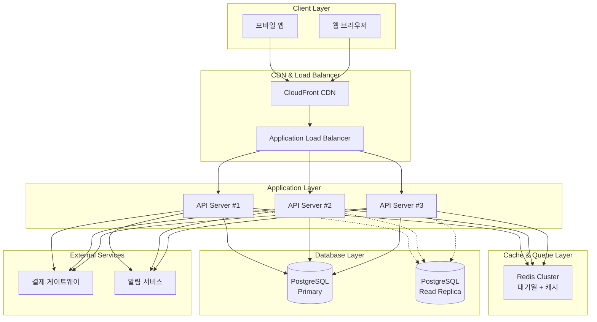
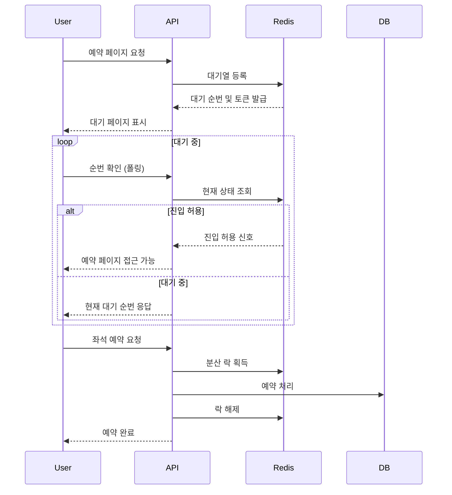

# 콘서트 예약 서비스 아키텍처

아직 설계 초기 단계라서, 복잡한 MSA 구조나 EDA 등의 설계는 고려하지 않았습니다.  
현재 상황에서 가장 최적의 설계를 고려하여 설계했습니다.  
추후 설계가 완료되면 업데이트 예정입니다.

## 전체 아키텍처

## 핵심 설계 전략

### 1. 대기열 시스템 (Virtual Waiting Room)

실제 티켓팅 서비스에서 사용하는 가상 대기실 방식을 채택합니다.

**동작 원리**

- 사용자가 예약 페이지 접근 시 대기열 진입
- Redis를 통한 순번 관리 및 진입 제어
- 정해진 수만큼 순차적으로 실제 예약 페이지 진입 허용

**대기열 플로우**

### 2. 동시성 제어

**Redis 분산 락**

- 좌석별 락으로 동시 예약 방지
- 락 획득 실패 시 즉시 실패 응답 (재시도 X)
- 단축된 TTL (10초)로 데드락 방지

**실시간 만료 검증**

- 좌석 조회/예약 시점에 만료된 임시 예약 실시간 체크
- 스케줄러 의존성 제거로 0초 지연 보장
- DB 트랜잭션 내에서 원자적 만료 처리

**DB 레벨 제어**

- 좌석 상태를 단순한 ENUM으로 관리
- `AVAILABLE` → `TEMPORARILY_RESERVED` → `RESERVED`
- 트랜잭션 격리 레벨: READ_COMMITTED

### 3. 스파이크 트래픽 대응

**계층별 부하 분산**

- CDN: 정적 리소스 캐싱
- Load Balancer: API 서버 간 트래픽 분산
- Redis: 세션 및 대기열 상태 관리
- DB Read Replica: 조회 트래픽 분산

**Rate Limiting**

- API Gateway 레벨에서 사용자당 호출 제한
- 대기열 자체가 트래픽 제어 역할

## 주요 컴포넌트

### API Server (NestJS/Express)

- RESTful API 제공
- JWT 기반 인증
- 비즈니스 로직 처리
- Auto Scaling 지원

### Redis Cluster

- **대기열 관리**: Sorted Set으로 순번 관리
- **세션 저장소**: JWT 토큰 검증
- **분산 락**: 좌석 예약 동시성 제어
- **캐싱**: 콘서트 정보, 좌석 배치도

### PostgreSQL

- **Primary**: 모든 쓰기 작업
- **Read Replica**: 조회 전용 (콘서트 목록, 통계)
- **파티셔닝**: 예약 테이블 날짜별 분할

## 성능 목표

**처리량**

- 동시 접속자: 10,000명
- API TPS: 1,000 req/sec
- 대기열 처리: 100명/초

**응답 시간**

- 대기열 진입: < 1초
- 좌석 조회: < 500ms
- 예약 처리: < 2초

## 운영 고려사항

### 모니터링

- 애플리케이션 로그 (JSON 형태)
- 시스템 메트릭 (CPU, Memory, Network)
- 비즈니스 메트릭 (대기자 수, 예약 성공률)

### 장애 대응

- Circuit Breaker: 외부 서비스 장애 시
- Health Check: Load Balancer 레벨
- Graceful Shutdown: 진행 중인 요청 완료 후 종료

### 확장성

- Horizontal Scaling: API 서버 추가
- Database Scaling: Read Replica 추가
- Cache Scaling: Redis Cluster 확장
