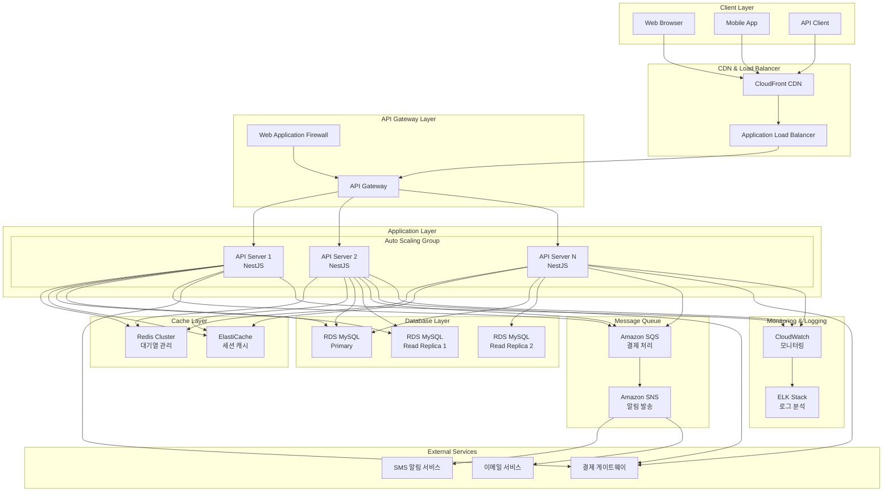
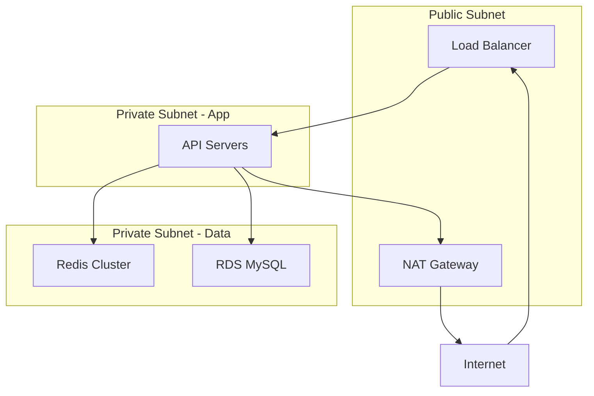

# 인프라 구성도

## 개요

콘서트 예약 서비스의 인프라 구성도입니다. 대용량 트래픽 처리, 동시성 제어, 고가용성을 고려한 클라우드 기반 아키텍처를 설계했습니다.

---

## 전체 아키텍처 다이어그램


```mermaid
graph TB
    subgraph "Client Layer"
        Web[Web Browser]
        Mobile[Mobile App]
        API_Client[API Client]
    end

    subgraph "CDN & Load Balancer"
        CDN[CloudFront CDN]
        ALB[Application Load Balancer]
    end

    subgraph "API Gateway Layer"
        AG[API Gateway]
        WAF[Web Application Firewall]
    end

    subgraph "Application Layer"
        subgraph "Auto Scaling Group"
            API1[API Server 1<br/>NestJS]
            API2[API Server 2<br/>NestJS]
            API3[API Server N<br/>NestJS]
        end
    end

    subgraph "Cache Layer"
        Redis_Cluster[Redis Cluster<br/>대기열 관리]
        ElastiCache[ElastiCache<br/>세션 캐시]
    end

    subgraph "Database Layer"
        RDS_Primary[RDS MySQL<br/>Primary]
        RDS_Replica1[RDS MySQL<br/>Read Replica 1]
        RDS_Replica2[RDS MySQL<br/>Read Replica 2]
    end

    subgraph "Message Queue"
        SQS[Amazon SQS<br/>결제 처리]
        SNS[Amazon SNS<br/>알림 발송]
    end

    subgraph "Monitoring & Logging"
        CloudWatch[CloudWatch<br/>모니터링]
        ELK[ELK Stack<br/>로그 분석]
    end

    subgraph "External Services"
        Payment_Gateway[결제 게이트웨이]
        SMS_Service[SMS 알림 서비스]
        Email_Service[이메일 서비스]
    end

    Web --> CDN
    Mobile --> CDN
    API_Client --> CDN

    CDN --> ALB
    ALB --> AG
    WAF --> AG

    AG --> API1
    AG --> API2
    AG --> API3

    API1 --> Redis_Cluster
    API2 --> Redis_Cluster
    API3 --> Redis_Cluster

    API1 --> ElastiCache
    API2 --> ElastiCache
    API3 --> ElastiCache

    API1 --> RDS_Primary
    API2 --> RDS_Primary
    API3 --> RDS_Primary

    API1 --> RDS_Replica1
    API2 --> RDS_Replica1
    API3 --> RDS_Replica2

    API1 --> SQS
    API2 --> SQS
    API3 --> SQS

    SQS --> SNS
    SNS --> SMS_Service
    SNS --> Email_Service

    API1 --> Payment_Gateway
    API2 --> Payment_Gateway
    API3 --> Payment_Gateway

    API1 --> CloudWatch
    API2 --> CloudWatch
    API3 --> CloudWatch

    CloudWatch --> ELK
```

---

## 계층별 상세 구성

### 1. 클라이언트 계층 (Client Layer)

#### Web Browser

- **역할**: 사용자 인터페이스 제공
- **기술**: React/Vue.js + TypeScript
- **특징**:
  - 반응형 웹 디자인
  - 실시간 대기열 상태 업데이트 (WebSocket/Server-Sent Events)
  - PWA(Progressive Web App) 지원

#### Mobile App

- **역할**: 모바일 환경 최적화된 UI 제공
- **기술**: React Native / Flutter
- **특징**:
  - 푸시 알림 지원
  - 오프라인 모드 지원
  - 생체 인증 연동

---

### 2. CDN 및 로드 밸런서 계층

#### CloudFront CDN

- **역할**: 정적 컨텐츠 캐싱 및 글로벌 배포
- **기능**:
  - 이미지, CSS, JS 파일 캐싱
  - 지리적 분산을 통한 응답 속도 개선
  - DDoS 공격 방어 1차 방어선
- **캐시 정책**:
  - 정적 리소스: 24시간 캐싱
  - API 응답: 캐싱 비활성화

#### Application Load Balancer (ALB)

- **역할**: 애플리케이션 서버 간 트래픽 분산
- **기능**:
  - HTTP/HTTPS 트래픽 라우팅
  - 헬스 체크 기반 자동 장애 조치
  - SSL/TLS 터미네이션
- **라우팅 규칙**:
  - `/api/v1/queue/*`: 대기열 전용 인스턴스
  - `/api/v1/payments/*`: 결제 전용 인스턴스
  - 기타: 범용 인스턴스

---

### 3. API 게이트웨이 계층

#### Amazon API Gateway

- **역할**: API 요청 관리 및 보안
- **기능**:
  - 요청 인증 및 권한 부여
  - Rate Limiting (사용자당 1분간 60회)
  - 요청/응답 변환
  - API 버전 관리
- **보안 설정**:
  - JWT 토큰 검증
  - IP 화이트리스트
  - CORS 정책 적용

#### Web Application Firewall (WAF)

- **역할**: 웹 애플리케이션 보안
- **보호 기능**:
  - SQL Injection 방어
  - XSS(Cross-Site Scripting) 방어
  - 악성 봇 차단
  - 지역별 접근 제한

---

### 4. 애플리케이션 계층

#### Auto Scaling Group

- **구성**: NestJS 기반 API 서버 3~10개 인스턴스
- **인스턴스 타입**:
  - 기본: t3.large (2 vCPU, 8GB RAM)
  - 피크 타임: c5.xlarge (4 vCPU, 8GB RAM)
- **스케일링 정책**:
  - CPU 사용률 70% 초과 시 스케일 아웃
  - 응답 시간 2초 초과 시 스케일 아웃
  - 최소 3개, 최대 10개 인스턴스

#### API Server 기능 분할

```
┌─────────────────┬─────────────────┬─────────────────┐
│   Queue Server  │  Booking Server │ Payment Server  │
├─────────────────┼─────────────────┼─────────────────┤
│ • 대기열 관리   │ • 좌석 조회     │ • 결제 처리     │
│ • 토큰 발급     │ • 좌석 예약     │ • 잔액 관리     │
│ • 상태 조회     │ • 예약 관리     │ • 거래 내역     │
└─────────────────┴─────────────────┴─────────────────┘
```

---

### 5. 캐시 계층

#### Redis Cluster (대기열 관리)

- **역할**: 대기열 순서 관리 및 토큰 검증
- **구성**: Master 3대 + Replica 3대
- **데이터 구조**:
  ```
  queue:position → Sorted Set (score: timestamp)
  queue:active → Set (활성 사용자)
  token:{user_id} → Hash (토큰 정보)
  ```
- **메모리**: 각 노드 16GB
- **백업**: 일일 스냅샷 + AOF 로그

#### ElastiCache (세션 캐시)

- **역할**: 세션 데이터 및 API 응답 캐싱
- **구성**: Redis 4.6 클러스터 모드
- **캐시 데이터**:
  - 사용자 세션 정보 (TTL: 30분)
  - 콘서트 목록 (TTL: 5분)
  - 좌석 현황 (TTL: 30초)

---

### 6. 데이터베이스 계층

#### RDS MySQL Primary

- **역할**: 메인 데이터베이스 (쓰기 전용)
- **사양**:
  - 인스턴스: db.r5.2xlarge (8 vCPU, 64GB RAM)
  - 스토리지: 1TB SSD (io1, 20,000 IOPS)
- **설정**:
  - Multi-AZ 배포로 고가용성 확보
  - 자동 백업 (7일 보관)
  - 바이너리 로그 활성화

#### RDS MySQL Read Replica

- **역할**: 읽기 전용 쿼리 처리
- **구성**: 2대 (서로 다른 AZ에 배치)
- **사양**: db.r5.xlarge (4 vCPU, 32GB RAM)
- **용도**:
  - 콘서트/좌석 조회
  - 예약 내역 조회
  - 통계 데이터 생성

---

### 7. 메시지 큐 계층

#### Amazon SQS (Simple Queue Service)

- **역할**: 비동기 작업 처리
- **큐 구성**:
  ```
  payment-queue: 결제 처리 요청
  notification-queue: 알림 발송 요청
  cleanup-queue: 만료된 예약 정리
  ```
- **설정**:
  - 가시성 타임아웃: 30초
  - 메시지 보관 기간: 14일
  - DLQ(Dead Letter Queue) 연결

#### Amazon SNS (Simple Notification Service)

- **역할**: 다중 채널 알림 발송
- **구독자**:
  - SMS 서비스 (예약 확정 알림)
  - 이메일 서비스 (티켓 발송)
  - 모바일 푸시 알림

---

### 8. 모니터링 및 로깅

#### CloudWatch

- **메트릭 수집**:
  - 애플리케이션 메트릭 (응답시간, 에러율)
  - 인프라 메트릭 (CPU, 메모리, 네트워크)
  - 비즈니스 메트릭 (예약 성공률, 대기열 길이)
- **알람 설정**:
  - API 응답시간 > 2초
  - 에러율 > 5%
  - 대기열 길이 > 10,000명

#### ELK Stack

- **구성**: Elasticsearch + Logstash + Kibana
- **로그 수집**:
  - 애플리케이션 로그
  - 액세스 로그
  - 에러 로그
- **대시보드**:
  - 실시간 트래픽 현황
  - 에러 추적 및 분석
  - 사용자 행동 분석

---

### 9. 외부 서비스 연동

#### 결제 게이트웨이

- **서비스**: 토스페이먼츠 / KG이니시스
- **연동 방식**: REST API + Webhook
- **보안**: TLS 1.3 + API Key 인증

#### 알림 서비스

- **SMS**: NHN Cloud SMS / AWS SNS
- **이메일**: AWS SES
- **푸시 알림**: Firebase Cloud Messaging

---

## 보안 구성

### 1. 네트워크 보안


```mermaid
graph TD
    subgraph "Public Subnet"
        ALB[Load Balancer]
        NAT[NAT Gateway]
    end

    subgraph "Private Subnet - App"
        API[API Servers]
    end

    subgraph "Private Subnet - Data"
        Redis[Redis Cluster]
        RDS[RDS MySQL]
    end

    Internet --> ALB
    ALB --> API
    API --> Redis
    API --> RDS
    API --> NAT
    NAT --> Internet
```

### 2. 접근 제어

- **VPC**: 격리된 네트워크 환경
- **Security Group**: 포트 기반 접근 제어
- **NACL**: 서브넷 레벨 방화벽
- **IAM Role**: 최소 권한 원칙 적용

### 3. 데이터 암호화

- **전송 중**: TLS 1.3 암호화
- **저장 시**: AES-256 암호화
- **데이터베이스**: Transparent Data Encryption
- **백업**: 암호화된 스냅샷 저장

---

## 성능 최적화

### 1. 캐싱 전략

```
Browser Cache (5분)
→ CDN Cache (1시간)
→ API Gateway Cache (1분)
→ Application Cache (30초)
→ Database
```

### 2. 데이터베이스 최적화

- **읽기 최적화**: Read Replica 활용
- **쓰기 최적화**: Connection Pool 설정
- **쿼리 최적화**: 인덱스 튜닝 및 쿼리 분석

### 3. 동시성 제어

- **낙관적 락**: 좌석 예약 시 버전 체크
- **비관적 락**: 결제 시 잔액 차감
- **분산 락**: Redis를 활용한 대기열 관리

---

## 배포 전략

### 1. Blue-Green 배포

- **Blue**: 현재 운영 환경
- **Green**: 새 버전 배포 환경
- **전환**: DNS 레코드 변경으로 무중단 배포

### 2. 롤링 업데이트

- 인스턴스별 순차 업데이트
- 헬스 체크 기반 트래픽 라우팅
- 자동 롤백 설정

---

## 재해 복구 계획

### 1. 백업 전략

- **데이터베이스**: 일일 전체 백업 + 실시간 바이너리 로그
- **코드**: Git 저장소 + 도커 이미지
- **설정**: Infrastructure as Code (Terraform)

### 2. 복구 시나리오

- **RTO (Recovery Time Objective)**: 30분
- **RPO (Recovery Point Objective)**: 5분
- **다중 AZ 배포**로 단일 장애점 제거

## 확장 계획

### 1. 단계별 확장

- **1단계**: 기본 구성 (동시 사용자 1만명)
- **2단계**: 캐시 레이어 강화 (동시 사용자 5만명)
- **3단계**: 마이크로서비스 분할 (동시 사용자 10만명)

### 2. 글로벌 확장

- **지역별 배포**: 아시아, 유럽, 미주
- **CDN 확장**: 엣지 로케이션 추가
- **데이터 복제**: 지역간 데이터 동기화
