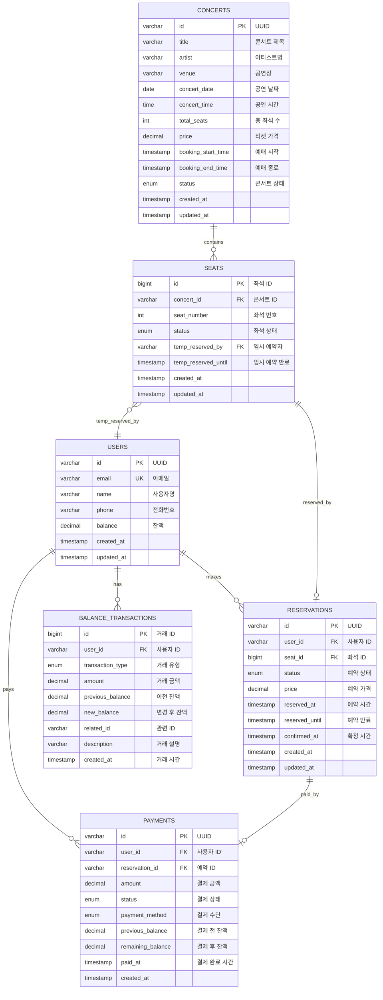

# 데이터 아키텍처 설계

## 개요

콘서트 예약 서비스의 **데이터 특성별 최적화된 저장소 설계**입니다. 비즈니스 요구사항과 데이터 특성에 따라 PostgreSQL과 Redis를 명확히 분리하여 설계했습니다.

---

## PostgreSQL 설계

### 1. Users (사용자)

```sql
CREATE TABLE users (
    id VARCHAR(36) PRIMARY KEY COMMENT 'UUID',
    email VARCHAR(255) NOT NULL UNIQUE COMMENT '이메일',
    name VARCHAR(100) NOT NULL COMMENT '사용자명',
    phone VARCHAR(20) COMMENT '전화번호',
    balance DECIMAL(12,2) DEFAULT 0.00 COMMENT '잔액',
    created_at TIMESTAMP DEFAULT CURRENT_TIMESTAMP,
    updated_at TIMESTAMP DEFAULT CURRENT_TIMESTAMP ON UPDATE CURRENT_TIMESTAMP,

    INDEX idx_email (email)
);
```

### 2. Concerts (콘서트)

```sql
CREATE TABLE concerts (
    id VARCHAR(36) PRIMARY KEY COMMENT 'UUID',
    title VARCHAR(200) NOT NULL COMMENT '콘서트 제목',
    artist VARCHAR(100) NOT NULL COMMENT '아티스트명',
    venue VARCHAR(200) NOT NULL COMMENT '공연장',
    concert_date DATE NOT NULL COMMENT '공연 날짜',
    concert_time TIME NOT NULL COMMENT '공연 시간',
    total_seats INT NOT NULL DEFAULT 50 COMMENT '총 좌석 수',
    price DECIMAL(10,2) NOT NULL COMMENT '티켓 가격',
    booking_start_time TIMESTAMP NOT NULL COMMENT '예매 시작',
    booking_end_time TIMESTAMP NOT NULL COMMENT '예매 종료',
    status ENUM('SCHEDULED', 'BOOKING_OPEN', 'BOOKING_CLOSED', 'CANCELLED') DEFAULT 'SCHEDULED',
    created_at TIMESTAMP DEFAULT CURRENT_TIMESTAMP,
    updated_at TIMESTAMP DEFAULT CURRENT_TIMESTAMP ON UPDATE CURRENT_TIMESTAMP,

    INDEX idx_concert_date (concert_date),
    INDEX idx_booking_period (booking_start_time, booking_end_time),
    INDEX idx_status (status)
);
```

### 3. Seats (좌석) - 상태 통일

```sql
CREATE TABLE seats (
    id BIGINT AUTO_INCREMENT PRIMARY KEY,
    concert_id VARCHAR(36) NOT NULL,
    seat_number INT NOT NULL COMMENT '좌석 번호 (1-50)',
    status ENUM('AVAILABLE', 'TEMPORARILY_RESERVED', 'RESERVED') DEFAULT 'AVAILABLE',
    temp_reserved_by VARCHAR(36) NULL COMMENT '임시 예약자',
    temp_reserved_until TIMESTAMP NULL COMMENT '임시 예약 만료',
    created_at TIMESTAMP DEFAULT CURRENT_TIMESTAMP,
    updated_at TIMESTAMP DEFAULT CURRENT_TIMESTAMP ON UPDATE CURRENT_TIMESTAMP,

    FOREIGN KEY (concert_id) REFERENCES concerts(id) ON DELETE CASCADE,
    FOREIGN KEY (temp_reserved_by) REFERENCES users(id) ON DELETE SET NULL,
    UNIQUE KEY unique_concert_seat (concert_id, seat_number),
    INDEX idx_concert_status (concert_id, status),
    INDEX idx_temp_reserved_until (temp_reserved_until)
);
```

### 4. Reservations (예약) - 단순화

```sql
CREATE TABLE reservations (
    id VARCHAR(36) PRIMARY KEY COMMENT 'UUID',
    user_id VARCHAR(36) NOT NULL,
    seat_id BIGINT NOT NULL,
    status ENUM('TEMPORARILY_RESERVED', 'CONFIRMED', 'CANCELLED', 'EXPIRED') DEFAULT 'TEMPORARILY_RESERVED',
    price DECIMAL(10,2) NOT NULL,
    reserved_at TIMESTAMP DEFAULT CURRENT_TIMESTAMP,
    reserved_until TIMESTAMP NOT NULL COMMENT '임시 예약 만료 시간',
    confirmed_at TIMESTAMP NULL,
    created_at TIMESTAMP DEFAULT CURRENT_TIMESTAMP,
    updated_at TIMESTAMP DEFAULT CURRENT_TIMESTAMP ON UPDATE CURRENT_TIMESTAMP,

    FOREIGN KEY (user_id) REFERENCES users(id) ON DELETE CASCADE,
    FOREIGN KEY (seat_id) REFERENCES seats(id) ON DELETE CASCADE,
    UNIQUE KEY unique_active_seat_reservation (seat_id),
    INDEX idx_user_status (user_id, status),
    INDEX idx_reserved_until (reserved_until)
);
```

### 5. Payments (결제)

```sql
CREATE TABLE payments (
    id VARCHAR(36) PRIMARY KEY COMMENT 'UUID',
    user_id VARCHAR(36) NOT NULL,
    reservation_id VARCHAR(36) NOT NULL,
    amount DECIMAL(10,2) NOT NULL,
    status ENUM('PENDING', 'COMPLETED', 'FAILED', 'CANCELLED') DEFAULT 'PENDING',
    payment_method ENUM('BALANCE') DEFAULT 'BALANCE',
    previous_balance DECIMAL(12,2) NOT NULL,
    remaining_balance DECIMAL(12,2) NOT NULL,
    paid_at TIMESTAMP NULL,
    created_at TIMESTAMP DEFAULT CURRENT_TIMESTAMP,

    FOREIGN KEY (user_id) REFERENCES users(id) ON DELETE CASCADE,
    FOREIGN KEY (reservation_id) REFERENCES reservations(id) ON DELETE CASCADE,
    UNIQUE KEY unique_reservation_payment (reservation_id),
    INDEX idx_user_status (user_id, status)
);
```

### 6. Balance_Transactions (잔액 거래내역)

```sql
CREATE TABLE balance_transactions (
    id BIGINT AUTO_INCREMENT PRIMARY KEY,
    user_id VARCHAR(36) NOT NULL,
    transaction_type ENUM('CHARGE', 'PAYMENT') NOT NULL,
    amount DECIMAL(10,2) NOT NULL,
    previous_balance DECIMAL(12,2) NOT NULL,
    new_balance DECIMAL(12,2) NOT NULL,
    related_id VARCHAR(36) NULL COMMENT '관련 결제/충전 ID',
    description VARCHAR(500) NULL,
    created_at TIMESTAMP DEFAULT CURRENT_TIMESTAMP,

    FOREIGN KEY (user_id) REFERENCES users(id) ON DELETE CASCADE,
    INDEX idx_user_created (user_id, created_at),
    INDEX idx_transaction_type (transaction_type)
);
```

---

## Redis 설계 - 실제 사용 패턴 반영

### 1. 대기열 관리 (단순화)

```redis
# 대기 순서 관리 (Sorted Set)
ZADD queue:waiting:{concertId} {timestamp} {userId}

# 활성 사용자 관리 (Set with TTL)
SADD queue:active:{concertId} {userId}
EXPIRE queue:active:{concertId} 3600

# 사용자 대기열 정보 (Hash with TTL)
HSET user:{userId}:queue position {position} status {status}
EXPIRE user:{userId}:queue 3600
```

### 2. 분산 락 (Distributed Lock)

```redis
# 좌석 예약 락
SETNX lock:seat:{seatId} {userId} EX 10

# 사용자 잔액 처리 락
SETNX lock:balance:{userId} "processing" EX 5
```

### 3. 캐시 관리

```redis
# 콘서트 목록 캐시 (JSON String)
SET cache:concerts:list "{json}" EX 60

# 좌석 정보 캐시 (JSON String)
SET cache:concert:{concertId}:seats "{json}" EX 300

# 사용자 잔액 캐시 (String)
SET cache:user:{userId}:balance {amount} EX 300
```

### 4. 토큰 관리

```redis
# JWT 토큰 블랙리스트 (Set with TTL)
SADD token:blacklist {jti}
EXPIRE token:blacklist {ttl}

# 사용자 활성 토큰 (String with TTL)
SET token:active:{userId} {tokenId} EX 3600
```

---

## ERD 다이어그램


