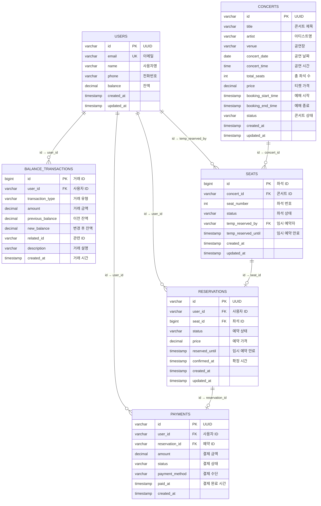

# 데이터 아키텍처 설계

## 개요

콘서트 예약 서비스의 **데이터 특성별 최적화된 저장소 설계**입니다. 비즈니스 요구사항과 데이터 특성에 따라 PostgreSQL과 Redis를 명확히 분리하여 설계했습니다.

---

## PostgreSQL 설계

### 1. Users (사용자)

```sql
CREATE TABLE users (
    id VARCHAR(36) PRIMARY KEY,
    email VARCHAR(255) NOT NULL UNIQUE,
    name VARCHAR(100) NOT NULL,
    phone VARCHAR(20),
    balance DECIMAL(12,2) DEFAULT 0.00,
    created_at TIMESTAMP DEFAULT CURRENT_TIMESTAMP,
    updated_at TIMESTAMP DEFAULT CURRENT_TIMESTAMP,

    -- 비즈니스 로직 제약조건
    CONSTRAINT chk_user_balance_non_negative CHECK (balance >= 0),
    CONSTRAINT chk_user_name_not_empty CHECK (LENGTH(TRIM(name)) > 0),
    CONSTRAINT chk_user_email_format CHECK (email ~* '^[A-Za-z0-9._%+-]+@[A-Za-z0-9.-]+\.[A-Za-z]{2,}$')
);

-- 인덱스 생성
CREATE INDEX idx_users_email ON users(email);
```

### 2. Concerts (콘서트)

```sql
CREATE TABLE concerts (
    id VARCHAR(36) PRIMARY KEY,
    title VARCHAR(200) NOT NULL,
    artist VARCHAR(100) NOT NULL,
    venue VARCHAR(200) NOT NULL,
    concert_date DATE NOT NULL,
    concert_time TIME NOT NULL,
    total_seats INT NOT NULL DEFAULT 50,
    price DECIMAL(10,2) NOT NULL,
    booking_start_time TIMESTAMP NOT NULL,
    booking_end_time TIMESTAMP NOT NULL,
    status VARCHAR(20) NOT NULL DEFAULT 'SCHEDULED',
    created_at TIMESTAMP DEFAULT CURRENT_TIMESTAMP,
    updated_at TIMESTAMP DEFAULT CURRENT_TIMESTAMP,

    -- 비즈니스 로직 제약조건
    CONSTRAINT chk_concert_title_not_empty CHECK (LENGTH(TRIM(title)) > 0),
    CONSTRAINT chk_concert_artist_not_empty CHECK (LENGTH(TRIM(artist)) > 0),
    CONSTRAINT chk_concert_venue_not_empty CHECK (LENGTH(TRIM(venue)) > 0),
    CONSTRAINT chk_concert_total_seats_positive CHECK (total_seats > 0),
    CONSTRAINT chk_concert_price_positive CHECK (price > 0),
    CONSTRAINT chk_concert_booking_period CHECK (booking_start_time < booking_end_time),
    CONSTRAINT chk_concert_status CHECK (status IN ('SCHEDULED', 'OPEN', 'CANCELLED', 'COMPLETED')),
    CONSTRAINT chk_concert_date_future CHECK (concert_date >= CURRENT_DATE)
);

-- 인덱스 생성
CREATE INDEX idx_concert_date ON concerts(concert_date);
CREATE INDEX idx_booking_period ON concerts(booking_start_time, booking_end_time);
CREATE INDEX idx_status ON concerts(status);
```

### 3. Seats (좌석)

```sql
CREATE TABLE seats (
    id BIGINT GENERATED ALWAYS AS IDENTITY PRIMARY KEY,
    concert_id VARCHAR(36) NOT NULL,
    seat_number INT NOT NULL,
    status VARCHAR(20) NOT NULL DEFAULT 'AVAILABLE',
    temp_reserved_by VARCHAR(36) NULL,
    temp_reserved_until TIMESTAMP NULL,
    created_at TIMESTAMP DEFAULT CURRENT_TIMESTAMP,
    updated_at TIMESTAMP DEFAULT CURRENT_TIMESTAMP,

    FOREIGN KEY (concert_id) REFERENCES concerts(id) ON DELETE CASCADE,
    FOREIGN KEY (temp_reserved_by) REFERENCES users(id) ON DELETE SET NULL,
    UNIQUE (concert_id, seat_number),

    -- 비즈니스 로직 제약조건
    CONSTRAINT chk_seat_number_positive CHECK (seat_number > 0),
    CONSTRAINT chk_seat_status CHECK (status IN ('AVAILABLE', 'TEMPORARILY_RESERVED', 'RESERVED', 'UNAVAILABLE')),
    CONSTRAINT chk_temp_reservation_logic CHECK (
        (status = 'TEMPORARILY_RESERVED' AND temp_reserved_by IS NOT NULL AND temp_reserved_until IS NOT NULL) OR
        (status != 'TEMPORARILY_RESERVED' AND temp_reserved_by IS NULL AND temp_reserved_until IS NULL)
    )
);

-- 인덱스 생성
CREATE INDEX idx_concert_status ON seats(concert_id, status);
CREATE INDEX idx_temp_reserved_until ON seats(temp_reserved_until) WHERE status = 'TEMPORARILY_RESERVED';
```

### 4. Reservations (예약)

```sql
CREATE TABLE reservations (
    id VARCHAR(36) PRIMARY KEY,
    user_id VARCHAR(36) NOT NULL,
    seat_id BIGINT NOT NULL,
    status VARCHAR(20) NOT NULL DEFAULT 'TEMPORARILY_RESERVED',
    price DECIMAL(10,2) NOT NULL,
    reserved_until TIMESTAMP NULL,
    confirmed_at TIMESTAMP NULL,
    created_at TIMESTAMP DEFAULT CURRENT_TIMESTAMP,
    updated_at TIMESTAMP DEFAULT CURRENT_TIMESTAMP,

    CONSTRAINT chk_reservation_status CHECK (status IN ('TEMPORARILY_RESERVED', 'CONFIRMED', 'CANCELLED')),
    FOREIGN KEY (user_id) REFERENCES users(id) ON DELETE CASCADE,
    FOREIGN KEY (seat_id) REFERENCES seats(id) ON DELETE CASCADE,

    -- 비즈니스 로직 제약조건
    CONSTRAINT chk_reservation_price_positive CHECK (price > 0),
    CONSTRAINT chk_reservation_timing_logic CHECK (
        (status = 'TEMPORARILY_RESERVED' AND reserved_until IS NOT NULL AND confirmed_at IS NULL) OR
        (status = 'CONFIRMED' AND confirmed_at IS NOT NULL) OR
        (status = 'CANCELLED')
    )
);

-- 확정된 예약에 대한 좌석 중복 방지 (부분 유니크 인덱스)
CREATE UNIQUE INDEX idx_confirmed_seat_reservation ON reservations(seat_id) WHERE status = 'CONFIRMED';

-- 인덱스 생성
CREATE INDEX idx_user_status ON reservations(user_id, status);
CREATE INDEX idx_seat_status ON reservations(seat_id, status);
CREATE INDEX idx_reserved_until ON reservations(reserved_until) WHERE status = 'TEMPORARILY_RESERVED';
```

### 5. Payments (결제)

```sql
CREATE TABLE payments (
    id VARCHAR(36) PRIMARY KEY,
    user_id VARCHAR(36) NOT NULL,
    reservation_id VARCHAR(36) NOT NULL,
    amount DECIMAL(10,2) NOT NULL,
    status VARCHAR(20) NOT NULL DEFAULT 'PENDING',
    payment_method VARCHAR(20) NOT NULL DEFAULT 'BALANCE',
    paid_at TIMESTAMP NULL,
    created_at TIMESTAMP DEFAULT CURRENT_TIMESTAMP,

    FOREIGN KEY (user_id) REFERENCES users(id) ON DELETE CASCADE,
    FOREIGN KEY (reservation_id) REFERENCES reservations(id) ON DELETE CASCADE,
    UNIQUE (reservation_id),

    -- 비즈니스 로직 제약조건
    CONSTRAINT chk_payment_amount_positive CHECK (amount > 0),
    CONSTRAINT chk_payment_status CHECK (status IN ('PENDING', 'COMPLETED', 'FAILED', 'CANCELLED')),
    CONSTRAINT chk_payment_method CHECK (payment_method IN ('BALANCE', 'CARD', 'BANK_TRANSFER')),
    CONSTRAINT chk_payment_paid_at_logic CHECK (
        (status = 'COMPLETED' AND paid_at IS NOT NULL) OR
        (status != 'COMPLETED' AND paid_at IS NULL)
    )
);

-- 인덱스 생성
CREATE INDEX idx_payments_user_status ON payments(user_id, status);
```

### 6. Balance_Transactions (잔액 거래내역)

원장 테이블 역할

```sql
CREATE TABLE balance_transactions (
    id BIGINT GENERATED ALWAYS AS IDENTITY PRIMARY KEY,
    user_id VARCHAR(36) NOT NULL,
    transaction_type VARCHAR(20) NOT NULL,
    amount DECIMAL(10,2) NOT NULL,
    previous_balance DECIMAL(12,2) NOT NULL,
    new_balance DECIMAL(12,2) NOT NULL,
    related_id VARCHAR(36) NULL,
    description VARCHAR(500) NULL,
    created_at TIMESTAMP DEFAULT CURRENT_TIMESTAMP,

    CONSTRAINT chk_transaction_type CHECK (transaction_type IN ('CHARGE', 'PAYMENT', 'REFUND')),
    FOREIGN KEY (user_id) REFERENCES users(id) ON DELETE CASCADE,

    -- 비즈니스 로직 제약조건
    CONSTRAINT chk_transaction_amount_positive CHECK (amount > 0),
    CONSTRAINT chk_transaction_balance_non_negative CHECK (previous_balance >= 0 AND new_balance >= 0),
    CONSTRAINT chk_transaction_balance_calculation CHECK (
        (transaction_type = 'CHARGE' AND new_balance = previous_balance + amount) OR
        (transaction_type = 'PAYMENT' AND new_balance = previous_balance - amount) OR
        (transaction_type = 'REFUND' AND new_balance = previous_balance + amount)
    )
);

-- 인덱스 생성
CREATE INDEX idx_user_created ON balance_transactions(user_id, created_at);
CREATE INDEX idx_transaction_type ON balance_transactions(transaction_type);
```

### 7. 자동 updated_at 업데이트를 위한 트리거

PostgreSQL에서 자동으로 `updated_at` 필드를 갱신하기 위한 트리거 함수와 트리거:

```sql
-- updated_at 자동 갱신 함수
CREATE OR REPLACE FUNCTION update_updated_at_column()
RETURNS TRIGGER AS $$
BEGIN
    NEW.updated_at = CURRENT_TIMESTAMP;
    RETURN NEW;
END;
$$ language 'plpgsql';

-- 각 테이블에 트리거 생성
CREATE TRIGGER update_concerts_updated_at
    BEFORE UPDATE ON concerts
    FOR EACH ROW EXECUTE FUNCTION update_updated_at_column();

CREATE TRIGGER update_seats_updated_at
    BEFORE UPDATE ON seats
    FOR EACH ROW EXECUTE FUNCTION update_updated_at_column();

CREATE TRIGGER update_reservations_updated_at
    BEFORE UPDATE ON reservations
    FOR EACH ROW EXECUTE FUNCTION update_updated_at_column();

CREATE TRIGGER update_users_updated_at
    BEFORE UPDATE ON users
    FOR EACH ROW EXECUTE FUNCTION update_updated_at_column();
```

---

## Redis 설계 - 실제 사용 패턴 반영

### 1. 콘서트별 대기열 관리

```redis
# 콘서트별 대기 순서 관리 (Sorted Set)
# 각 콘서트마다 독립적인 대기열 운영
ZADD queue:waiting:concert-iu-001 {timestamp} {userId}
ZADD queue:waiting:concert-bts-002 {timestamp} {userId}

# 콘서트별 활성 사용자 관리 (Set with TTL)
SADD queue:active:concert-iu-001 {userId}
EXPIRE queue:active:concert-iu-001 3600

# 사용자 대기열 정보 (Hash with TTL)
# concertId 포함하여 어느 콘서트 대기열인지 명시
HSET user:{userId}:queue:concert-iu-001 position {position} status {status}
EXPIRE user:{userId}:queue:concert-iu-001 3600
```

### 2. 임시 예약 관리 (Temporary Reservations)

```redis
# 임시 예약 (5분 TTL)
SETEX temp_reservation:seat:{seatId} 300 {userId}

# 사용자별 임시 예약 추적
SETEX user_temp_reservation:{userId} 300 {seatId}

# 콘서트별 임시 예약된 좌석 목록
SADD temp_reserved_seats:{concertId} {seatId}
EXPIRE temp_reserved_seats:{concertId} 300

# 임시 예약 확인
EXISTS temp_reservation:seat:{seatId}

# 원자적 임시 예약 시도 (NX: 이미 존재하면 실패)
SET temp_reservation:seat:{seatId} {userId} EX 300 NX
```

### 3. 분산 락 (Distributed Lock)

```redis
# 좌석 예약 락
SETNX lock:seat:{seatId} {userId} EX 10

# 사용자 잔액 처리 락
SETNX lock:balance:{userId} "processing" EX 5
```

### 4. 캐시 관리

```redis
# 콘서트 목록 캐시 (JSON String)
SET cache:concerts:list "{json}" EX 60

# 좌석 정보 캐시 (JSON String)
SET cache:concert:{concertId}:seats "{json}" EX 300

# 사용자 잔액 캐시 (String)
SET cache:user:{userId}:balance {amount} EX 300
```

### 5. 토큰 관리

```redis
# JWT 토큰 블랙리스트 (Set with TTL)
SADD token:blacklist {jti}
EXPIRE token:blacklist {ttl}

# 사용자 활성 토큰 (String with TTL)
SET token:active:{userId} {tokenId} EX 3600
```

---

## ERD 다이어그램


