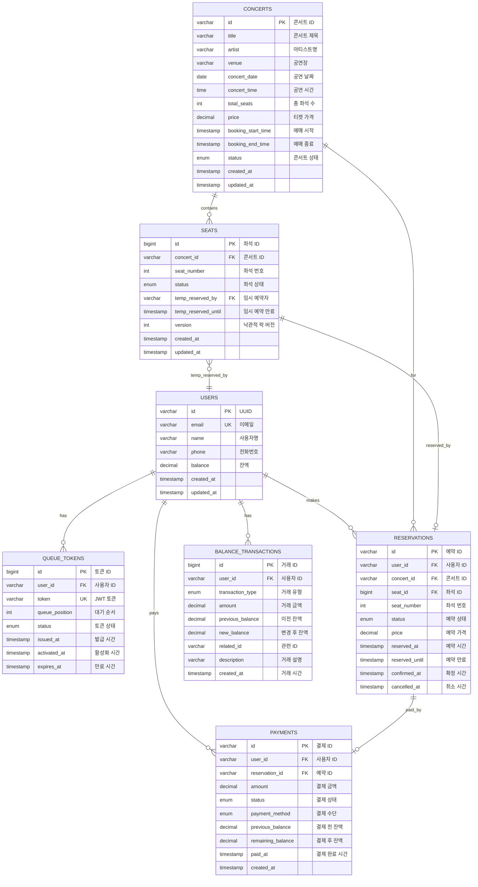

# ERD (Entity Relationship Diagram)

## 개요

콘서트 예약 서비스의 데이터베이스 설계 문서입니다. 대기열, 사용자, 콘서트, 좌석, 예약, 결제 등의 핵심 엔티티와 그들 간의 관계를 정의합니다.

---

## 엔티티 설계

### 1. Users (사용자)

사용자 정보를 관리하는 테이블입니다.

```sql
CREATE TABLE users (
    id VARCHAR(36) PRIMARY KEY COMMENT 'UUID',
    email VARCHAR(255) NOT NULL UNIQUE COMMENT '이메일',
    name VARCHAR(100) NOT NULL COMMENT '사용자명',
    phone VARCHAR(20) COMMENT '전화번호',
    balance DECIMAL(12,2) DEFAULT 0.00 COMMENT '잔액',
    created_at TIMESTAMP DEFAULT CURRENT_TIMESTAMP COMMENT '생성일시',
    updated_at TIMESTAMP DEFAULT CURRENT_TIMESTAMP ON UPDATE CURRENT_TIMESTAMP COMMENT '수정일시',

    INDEX idx_email (email),
    INDEX idx_balance (balance)
);
```

**주요 필드:**

- `id`: 사용자 고유 식별자 (UUID)
- `balance`: 사용자 잔액 (결제에 사용)
- 잔액 조회 성능을 위한 인덱스 추가

---

### 2. Queue_Tokens (대기열 토큰)

대기열 관리를 위한 토큰 정보를 저장합니다.

```sql
CREATE TABLE queue_tokens (
    id BIGINT AUTO_INCREMENT PRIMARY KEY COMMENT '토큰 ID',
    user_id VARCHAR(36) NOT NULL COMMENT '사용자 ID',
    token VARCHAR(512) NOT NULL UNIQUE COMMENT 'JWT 토큰',
    queue_position INT NOT NULL COMMENT '대기 순서',
    status ENUM('WAITING', 'ACTIVE', 'EXPIRED', 'COMPLETED') NOT NULL DEFAULT 'WAITING' COMMENT '토큰 상태',
    issued_at TIMESTAMP DEFAULT CURRENT_TIMESTAMP COMMENT '발급 시간',
    activated_at TIMESTAMP NULL COMMENT '활성화 시간',
    expires_at TIMESTAMP NULL COMMENT '만료 시간',

    FOREIGN KEY (user_id) REFERENCES users(id) ON DELETE CASCADE,
    UNIQUE KEY unique_active_user (user_id, status),
    INDEX idx_status_position (status, queue_position),
    INDEX idx_expires_at (expires_at),
    INDEX idx_user_status (user_id, status)
);
```

**주요 필드:**

- `queue_position`: 대기 순서 (1부터 시작)
- `status`: 토큰 상태 (대기/활성/만료/완료)
- `activated_at`: 예약 가능 상태가 된 시점
- `expires_at`: 토큰 만료 시점

**비즈니스 로직:**

- 한 사용자는 하나의 활성 토큰만 가질 수 있음
- 대기 순서는 발급 시간 기준으로 자동 부여

---

### 3. Concerts (콘서트)

콘서트 기본 정보를 관리합니다.

```sql
CREATE TABLE concerts (
    id VARCHAR(36) PRIMARY KEY COMMENT '콘서트 ID',
    title VARCHAR(200) NOT NULL COMMENT '콘서트 제목',
    artist VARCHAR(100) NOT NULL COMMENT '아티스트명',
    venue VARCHAR(200) NOT NULL COMMENT '공연장',
    concert_date DATE NOT NULL COMMENT '공연 날짜',
    concert_time TIME NOT NULL COMMENT '공연 시간',
    total_seats INT NOT NULL DEFAULT 50 COMMENT '총 좌석 수',
    price DECIMAL(10,2) NOT NULL COMMENT '티켓 가격',
    booking_start_time TIMESTAMP NOT NULL COMMENT '예매 시작 시간',
    booking_end_time TIMESTAMP NOT NULL COMMENT '예매 종료 시간',
    status ENUM('SCHEDULED', 'BOOKING_OPEN', 'BOOKING_CLOSED', 'CANCELLED') NOT NULL DEFAULT 'SCHEDULED' COMMENT '콘서트 상태',
    created_at TIMESTAMP DEFAULT CURRENT_TIMESTAMP COMMENT '생성일시',
    updated_at TIMESTAMP DEFAULT CURRENT_TIMESTAMP ON UPDATE CURRENT_TIMESTAMP COMMENT '수정일시',

    INDEX idx_concert_date (concert_date),
    INDEX idx_booking_period (booking_start_time, booking_end_time),
    INDEX idx_status (status)
);
```

**주요 필드:**

- `concert_date`: 공연 날짜
- `total_seats`: 총 좌석 수 (기본 50석)
- `booking_start_time` / `booking_end_time`: 예매 가능 기간

---

### 4. Seats (좌석)

각 콘서트별 좌석 정보를 관리합니다.

```sql
CREATE TABLE seats (
    id BIGINT AUTO_INCREMENT PRIMARY KEY COMMENT '좌석 ID',
    concert_id VARCHAR(36) NOT NULL COMMENT '콘서트 ID',
    seat_number INT NOT NULL COMMENT '좌석 번호',
    status ENUM('AVAILABLE', 'TEMPORARILY_RESERVED', 'RESERVED') NOT NULL DEFAULT 'AVAILABLE' COMMENT '좌석 상태',
    temp_reserved_by VARCHAR(36) NULL COMMENT '임시 예약 사용자 ID',
    temp_reserved_until TIMESTAMP NULL COMMENT '임시 예약 만료 시간',
    version INT NOT NULL DEFAULT 0 COMMENT '낙관적 락을 위한 버전',
    created_at TIMESTAMP DEFAULT CURRENT_TIMESTAMP COMMENT '생성일시',
    updated_at TIMESTAMP DEFAULT CURRENT_TIMESTAMP ON UPDATE CURRENT_TIMESTAMP COMMENT '수정일시',

    FOREIGN KEY (concert_id) REFERENCES concerts(id) ON DELETE CASCADE,
    FOREIGN KEY (temp_reserved_by) REFERENCES users(id) ON DELETE SET NULL,
    UNIQUE KEY unique_concert_seat (concert_id, seat_number),
    INDEX idx_concert_status (concert_id, status),
    INDEX idx_temp_reserved_until (temp_reserved_until)
);
```

**주요 필드:**

- `seat_number`: 좌석 번호 (1-50)
- `status`: 좌석 상태 (예약가능/임시예약/예약완료)
- `temp_reserved_until`: 임시 예약 만료 시간 (5분)
- `version`: 동시성 제어를 위한 낙관적 락

**비즈니스 로직:**

- 임시 예약 시간 만료 시 자동으로 AVAILABLE 상태로 변경
- 하나의 콘서트에서 좌석 번호는 유일

---

### 5. Reservations (예약)

좌석 예약 정보를 관리합니다.

```sql
CREATE TABLE reservations (
    id VARCHAR(36) PRIMARY KEY COMMENT '예약 ID',
    user_id VARCHAR(36) NOT NULL COMMENT '사용자 ID',
    concert_id VARCHAR(36) NOT NULL COMMENT '콘서트 ID',
    seat_id BIGINT NOT NULL COMMENT '좌석 ID',
    seat_number INT NOT NULL COMMENT '좌석 번호',
    status ENUM('TEMPORARILY_RESERVED', 'CONFIRMED', 'CANCELLED', 'EXPIRED') NOT NULL DEFAULT 'TEMPORARILY_RESERVED' COMMENT '예약 상태',
    price DECIMAL(10,2) NOT NULL COMMENT '예약 가격',
    reserved_at TIMESTAMP DEFAULT CURRENT_TIMESTAMP COMMENT '예약 시간',
    reserved_until TIMESTAMP NOT NULL COMMENT '예약 만료 시간',
    confirmed_at TIMESTAMP NULL COMMENT '확정 시간',
    cancelled_at TIMESTAMP NULL COMMENT '취소 시간',

    FOREIGN KEY (user_id) REFERENCES users(id) ON DELETE CASCADE,
    FOREIGN KEY (concert_id) REFERENCES concerts(id) ON DELETE CASCADE,
    FOREIGN KEY (seat_id) REFERENCES seats(id) ON DELETE CASCADE,
    UNIQUE KEY unique_active_seat_reservation (seat_id, status),
    INDEX idx_user_status (user_id, status),
    INDEX idx_reserved_until (reserved_until),
    INDEX idx_concert_user (concert_id, user_id)
);
```

**주요 필드:**

- `reserved_until`: 임시 예약 만료 시간
- `status`: 예약 상태 (임시예약/확정/취소/만료)
- `confirmed_at`: 결제 완료로 예약이 확정된 시간

**비즈니스 로직:**

- 하나의 좌석에는 하나의 활성 예약만 존재
- 임시 예약 시간 만료 시 자동으로 EXPIRED 상태로 변경

---

### 6. Payments (결제)

결제 내역을 관리합니다.

```sql
CREATE TABLE payments (
    id VARCHAR(36) PRIMARY KEY COMMENT '결제 ID',
    user_id VARCHAR(36) NOT NULL COMMENT '사용자 ID',
    reservation_id VARCHAR(36) NOT NULL COMMENT '예약 ID',
    amount DECIMAL(10,2) NOT NULL COMMENT '결제 금액',
    status ENUM('PENDING', 'COMPLETED', 'FAILED', 'CANCELLED') NOT NULL DEFAULT 'PENDING' COMMENT '결제 상태',
    payment_method ENUM('BALANCE') NOT NULL DEFAULT 'BALANCE' COMMENT '결제 수단',
    previous_balance DECIMAL(12,2) NOT NULL COMMENT '결제 전 잔액',
    remaining_balance DECIMAL(12,2) NOT NULL COMMENT '결제 후 잔액',
    paid_at TIMESTAMP NULL COMMENT '결제 완료 시간',
    created_at TIMESTAMP DEFAULT CURRENT_TIMESTAMP COMMENT '생성일시',

    FOREIGN KEY (user_id) REFERENCES users(id) ON DELETE CASCADE,
    FOREIGN KEY (reservation_id) REFERENCES reservations(id) ON DELETE CASCADE,
    UNIQUE KEY unique_reservation_payment (reservation_id),
    INDEX idx_user_status (user_id, status),
    INDEX idx_paid_at (paid_at)
);
```

**주요 필드:**

- `payment_method`: 결제 수단 (현재는 잔액 결제만 지원)
- `previous_balance` / `remaining_balance`: 결제 전후 잔액
- 한 예약에 대해서는 하나의 결제만 가능

---

### 7. Balance_Transactions (잔액 거래내역)

사용자 잔액 변동 내역을 추적합니다.

```sql
CREATE TABLE balance_transactions (
    id BIGINT AUTO_INCREMENT PRIMARY KEY COMMENT '거래 ID',
    user_id VARCHAR(36) NOT NULL COMMENT '사용자 ID',
    transaction_type ENUM('CHARGE', 'PAYMENT') NOT NULL COMMENT '거래 유형',
    amount DECIMAL(10,2) NOT NULL COMMENT '거래 금액',
    previous_balance DECIMAL(12,2) NOT NULL COMMENT '이전 잔액',
    new_balance DECIMAL(12,2) NOT NULL COMMENT '변경 후 잔액',
    related_id VARCHAR(36) NULL COMMENT '관련 ID (결제 ID 등)',
    description VARCHAR(500) NULL COMMENT '거래 설명',
    created_at TIMESTAMP DEFAULT CURRENT_TIMESTAMP COMMENT '거래 시간',

    FOREIGN KEY (user_id) REFERENCES users(id) ON DELETE CASCADE,
    INDEX idx_user_created (user_id, created_at),
    INDEX idx_transaction_type (transaction_type),
    INDEX idx_related_id (related_id)
);
```

**주요 필드:**

- `transaction_type`: 거래 유형 (충전/결제)
- `related_id`: 관련된 결제 ID 또는 충전 요청 ID
- 모든 잔액 변동을 추적하여 감사 기능 제공

---

## ERD 다이어그램


```mermaid
erDiagram
    USERS ||--o{ QUEUE_TOKENS : has
    USERS ||--o{ RESERVATIONS : makes
    USERS ||--o{ PAYMENTS : pays
    USERS ||--o{ BALANCE_TRANSACTIONS : has

    CONCERTS ||--o{ SEATS : contains
    CONCERTS ||--o{ RESERVATIONS : for

    SEATS ||--o| RESERVATIONS : reserved_by
    SEATS }o--|| USERS : temp_reserved_by

    RESERVATIONS ||--o| PAYMENTS : paid_by

    USERS {
        varchar id PK "UUID"
        varchar email UK "이메일"
        varchar name "사용자명"
        varchar phone "전화번호"
        decimal balance "잔액"
        timestamp created_at
        timestamp updated_at
    }

    QUEUE_TOKENS {
        bigint id PK "토큰 ID"
        varchar user_id FK "사용자 ID"
        varchar token UK "JWT 토큰"
        int queue_position "대기 순서"
        enum status "토큰 상태"
        timestamp issued_at "발급 시간"
        timestamp activated_at "활성화 시간"
        timestamp expires_at "만료 시간"
    }

    CONCERTS {
        varchar id PK "콘서트 ID"
        varchar title "콘서트 제목"
        varchar artist "아티스트명"
        varchar venue "공연장"
        date concert_date "공연 날짜"
        time concert_time "공연 시간"
        int total_seats "총 좌석 수"
        decimal price "티켓 가격"
        timestamp booking_start_time "예매 시작"
        timestamp booking_end_time "예매 종료"
        enum status "콘서트 상태"
        timestamp created_at
        timestamp updated_at
    }

    SEATS {
        bigint id PK "좌석 ID"
        varchar concert_id FK "콘서트 ID"
        int seat_number "좌석 번호"
        enum status "좌석 상태"
        varchar temp_reserved_by FK "임시 예약자"
        timestamp temp_reserved_until "임시 예약 만료"
        int version "낙관적 락 버전"
        timestamp created_at
        timestamp updated_at
    }

    RESERVATIONS {
        varchar id PK "예약 ID"
        varchar user_id FK "사용자 ID"
        varchar concert_id FK "콘서트 ID"
        bigint seat_id FK "좌석 ID"
        int seat_number "좌석 번호"
        enum status "예약 상태"
        decimal price "예약 가격"
        timestamp reserved_at "예약 시간"
        timestamp reserved_until "예약 만료"
        timestamp confirmed_at "확정 시간"
        timestamp cancelled_at "취소 시간"
    }

    PAYMENTS {
        varchar id PK "결제 ID"
        varchar user_id FK "사용자 ID"
        varchar reservation_id FK "예약 ID"
        decimal amount "결제 금액"
        enum status "결제 상태"
        enum payment_method "결제 수단"
        decimal previous_balance "결제 전 잔액"
        decimal remaining_balance "결제 후 잔액"
        timestamp paid_at "결제 완료 시간"
        timestamp created_at
    }

    BALANCE_TRANSACTIONS {
        bigint id PK "거래 ID"
        varchar user_id FK "사용자 ID"
        enum transaction_type "거래 유형"
        decimal amount "거래 금액"
        decimal previous_balance "이전 잔액"
        decimal new_balance "변경 후 잔액"
        varchar related_id "관련 ID"
        varchar description "거래 설명"
        timestamp created_at "거래 시간"
    }
```

---

## 주요 제약사항 및 인덱스

### 1. 유니크 제약사항

- `users.email`: 이메일 중복 불가
- `queue_tokens.token`: 토큰 중복 불가
- `queue_tokens(user_id, status)`: 사용자별 활성 토큰 하나만
- `seats(concert_id, seat_number)`: 콘서트별 좌석 번호 유일
- `reservations(seat_id, status)`: 좌석별 활성 예약 하나만
- `payments.reservation_id`: 예약별 결제 하나만

### 2. 성능 최적화 인덱스

- `idx_queue_status_position`: 대기열 순서 조회용
- `idx_seats_concert_status`: 콘서트별 예약 가능 좌석 조회용
- `idx_reservations_reserved_until`: 임시 예약 만료 처리용
- `idx_balance_transactions_user_created`: 사용자별 거래내역 조회용

### 3. 외래키 제약사항

- 모든 외래키는 `ON DELETE CASCADE` 또는 `ON DELETE SET NULL` 설정
- 데이터 무결성 보장 및 연관 데이터 자동 정리

---

## 동시성 제어 전략

### 1. 좌석 예약 (Optimistic Lock)

- `seats.version` 필드를 활용한 낙관적 락
- 동시 예약 시도 시 version mismatch로 충돌 감지

### 2. 잔액 관리 (Pessimistic Lock)

- 결제 시 `users` 테이블 row-level lock
- 잔액 부족 상황에서의 동시성 문제 방지

### 3. 대기열 관리 (Atomic Operations)

- Redis를 활용한 원자적 순서 부여
- 데이터베이스는 최종 상태 저장용

---

## 데이터 정리 정책

### 1. 자동 만료 처리

- 임시 예약 만료: 스케줄러로 주기적 정리
- 토큰 만료: 스케줄러로 주기적 정리

### 2. 아카이브 정책

- 완료된 콘서트: 6개월 후 아카이브 테이블로 이동
- 결제 내역: 3년간 보관 후 압축 저장
