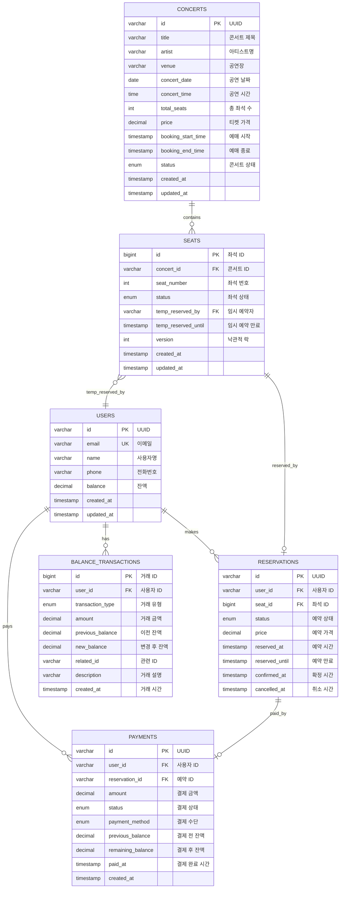

# 데이터 아키텍처 설계

## 개요

콘서트 예약 서비스의 **데이터 특성별 최적화된 저장소 설계**입니다. 비즈니스 요구사항과 데이터 특성에 따라 RDB와 Redis를 명확히 분리하여 설계했습니다.

---

## RDB 설계

### 1. Users (사용자)

```sql
CREATE TABLE users (
    id VARCHAR(36) PRIMARY KEY COMMENT 'UUID',
    email VARCHAR(255) NOT NULL UNIQUE COMMENT '이메일',
    name VARCHAR(100) NOT NULL COMMENT '사용자명',
    phone VARCHAR(20) COMMENT '전화번호',
    balance DECIMAL(12,2) DEFAULT 0.00 COMMENT '잔액',
    created_at TIMESTAMP DEFAULT CURRENT_TIMESTAMP,
    updated_at TIMESTAMP DEFAULT CURRENT_TIMESTAMP ON UPDATE CURRENT_TIMESTAMP,

    INDEX idx_email (email)
);
```

### 2. Concerts (콘서트)

```sql
CREATE TABLE concerts (
    id VARCHAR(36) PRIMARY KEY COMMENT 'UUID',
    title VARCHAR(200) NOT NULL COMMENT '콘서트 제목',
    artist VARCHAR(100) NOT NULL COMMENT '아티스트명',
    venue VARCHAR(200) NOT NULL COMMENT '공연장',
    concert_date DATE NOT NULL COMMENT '공연 날짜',
    concert_time TIME NOT NULL COMMENT '공연 시간',
    total_seats INT NOT NULL DEFAULT 50 COMMENT '총 좌석 수',
    price DECIMAL(10,2) NOT NULL COMMENT '티켓 가격',
    booking_start_time TIMESTAMP NOT NULL COMMENT '예매 시작',
    booking_end_time TIMESTAMP NOT NULL COMMENT '예매 종료',
    status ENUM('SCHEDULED', 'BOOKING_OPEN', 'BOOKING_CLOSED', 'CANCELLED') DEFAULT 'SCHEDULED',
    created_at TIMESTAMP DEFAULT CURRENT_TIMESTAMP,
    updated_at TIMESTAMP DEFAULT CURRENT_TIMESTAMP ON UPDATE CURRENT_TIMESTAMP,

    INDEX idx_concert_date (concert_date),
    INDEX idx_booking_period (booking_start_time, booking_end_time),
    INDEX idx_status (status)
);
```

### 3. Seats (좌석)

```sql
CREATE TABLE seats (
    id BIGINT AUTO_INCREMENT PRIMARY KEY,
    concert_id VARCHAR(36) NOT NULL,
    seat_number INT NOT NULL COMMENT '좌석 번호 (1-50)',
    status ENUM('AVAILABLE', 'TEMPORARILY_RESERVED', 'RESERVED') DEFAULT 'AVAILABLE',
    temp_reserved_by VARCHAR(36) NULL COMMENT '임시 예약자',
    temp_reserved_until TIMESTAMP NULL COMMENT '임시 예약 만료',
    created_at TIMESTAMP DEFAULT CURRENT_TIMESTAMP,
    updated_at TIMESTAMP DEFAULT CURRENT_TIMESTAMP ON UPDATE CURRENT_TIMESTAMP,

    FOREIGN KEY (concert_id) REFERENCES concerts(id) ON DELETE CASCADE,
    FOREIGN KEY (temp_reserved_by) REFERENCES users(id) ON DELETE SET NULL,
    UNIQUE KEY unique_concert_seat (concert_id, seat_number),
    INDEX idx_concert_status (concert_id, status)
);
```

### 4. Reservations (예약)

```sql
CREATE TABLE reservations (
    id VARCHAR(36) PRIMARY KEY COMMENT 'UUID',
    user_id VARCHAR(36) NOT NULL,
    seat_id BIGINT NOT NULL,
    status ENUM('TEMPORARILY_RESERVED', 'CONFIRMED', 'CANCELLED', 'EXPIRED') DEFAULT 'TEMPORARILY_RESERVED',
    price DECIMAL(10,2) NOT NULL,
    reserved_at TIMESTAMP DEFAULT CURRENT_TIMESTAMP,
    reserved_until TIMESTAMP NOT NULL COMMENT '임시 예약 만료 시간',
    confirmed_at TIMESTAMP NULL,
    cancelled_at TIMESTAMP NULL,

    FOREIGN KEY (user_id) REFERENCES users(id) ON DELETE CASCADE,
    FOREIGN KEY (seat_id) REFERENCES seats(id) ON DELETE CASCADE,
    UNIQUE KEY unique_active_seat_reservation (seat_id),
    INDEX idx_user_status (user_id, status),
    INDEX idx_reserved_until (reserved_until)
);
```

### 5. Payments (결제)

```sql
CREATE TABLE payments (
    id VARCHAR(36) PRIMARY KEY COMMENT 'UUID',
    user_id VARCHAR(36) NOT NULL,
    reservation_id VARCHAR(36) NOT NULL,
    amount DECIMAL(10,2) NOT NULL,
    status ENUM('PENDING', 'COMPLETED', 'FAILED', 'CANCELLED') DEFAULT 'PENDING',
    payment_method ENUM('BALANCE') DEFAULT 'BALANCE',
    previous_balance DECIMAL(12,2) NOT NULL,
    remaining_balance DECIMAL(12,2) NOT NULL,
    paid_at TIMESTAMP NULL,
    created_at TIMESTAMP DEFAULT CURRENT_TIMESTAMP,

    FOREIGN KEY (user_id) REFERENCES users(id) ON DELETE CASCADE,
    FOREIGN KEY (reservation_id) REFERENCES reservations(id) ON DELETE CASCADE,
    UNIQUE KEY unique_reservation_payment (reservation_id),
    INDEX idx_user_status (user_id, status)
);
```

### 6. Balance_Transactions (잔액 거래내역)

원장 DB의 목적으로 사용되는 테이블입니다.

```sql
CREATE TABLE balance_transactions (
    id BIGINT AUTO_INCREMENT PRIMARY KEY,
    user_id VARCHAR(36) NOT NULL,
    transaction_type ENUM('CHARGE', 'PAYMENT') NOT NULL,
    amount DECIMAL(10,2) NOT NULL,
    previous_balance DECIMAL(12,2) NOT NULL,
    new_balance DECIMAL(12,2) NOT NULL,
    related_id VARCHAR(36) NULL COMMENT '관련 결제/충전 ID',
    description VARCHAR(500) NULL,
    created_at TIMESTAMP DEFAULT CURRENT_TIMESTAMP,

    FOREIGN KEY (user_id) REFERENCES users(id) ON DELETE CASCADE,
    INDEX idx_user_created (user_id, created_at),
    INDEX idx_transaction_type (transaction_type)
);
```

---

## Redis 설계

### 1. 대기열 관리

```redis
# 대기 순서 (Sorted Set - timestamp 기준)
ZADD queue:waiting {timestamp} {userId}

# 활성 사용자 (Set with TTL)
SADD queue:active {userId}
EXPIRE queue:active 3600

# 사용자별 대기 상태 (Hash)
HSET user:{userId}:queue
  position 1247
  status "WAITING"
  queueId "queue-123-456"
EXPIRE user:{userId}:queue 86400

# 대기열 통계 (Hash)
HSET queue:stats
  totalWaiting 5000
  totalActive 100
```

### 2. 세션 관리

```redis
# JWT 토큰 블랙리스트 (Set with TTL)
SADD token:blacklist {jti}
EXPIRE token:blacklist 3600

# 사용자 활성 세션 (String with TTL)
SET session:{userId} "active"
EXPIRE session:{userId} 3600
```

### 3. 캐시 관리

```redis
# 콘서트별 예약 가능 좌석 수 (String)
SET cache:concert:{concertId}:available_seats 35
EXPIRE cache:concert:{concertId}:available_seats 300

# API 응답 캐시 (String)
SET cache:concerts:dates "{json_response}"
EXPIRE cache:concerts:dates 60
```

**Redis 데이터 TTL 정책:**

- 대기열 상태: 24시간
- 활성 세션: 1시간
- 캐시 데이터: 1-5분

### 4. 동시성 제어

#### Redis 분산 락

```redis
# 좌석 점유 락
SET seat:{seatId}:lock {userId} EX 10 NX

# 잔액 처리 락
SET balance:{userId}:lock "processing" EX 5 NX

```

---

## 📊 ERD 다이어그램


```mermaid
erDiagram
    USERS ||--o{ RESERVATIONS : makes
    USERS ||--o{ PAYMENTS : pays
    USERS ||--o{ BALANCE_TRANSACTIONS : has

    CONCERTS ||--o{ SEATS : contains

    SEATS ||--o| RESERVATIONS : reserved_by
    SEATS }o--|| USERS : temp_reserved_by

    RESERVATIONS ||--o| PAYMENTS : paid_by

    USERS {
        varchar id PK "UUID"
        varchar email UK "이메일"
        varchar name "사용자명"
        varchar phone "전화번호"
        decimal balance "잔액"
        timestamp created_at
        timestamp updated_at
    }

    CONCERTS {
        varchar id PK "UUID"
        varchar title "콘서트 제목"
        varchar artist "아티스트명"
        varchar venue "공연장"
        date concert_date "공연 날짜"
        time concert_time "공연 시간"
        int total_seats "총 좌석 수"
        decimal price "티켓 가격"
        timestamp booking_start_time "예매 시작"
        timestamp booking_end_time "예매 종료"
        enum status "콘서트 상태"
        timestamp created_at
        timestamp updated_at
    }

    SEATS {
        bigint id PK "좌석 ID"
        varchar concert_id FK "콘서트 ID"
        int seat_number "좌석 번호"
        enum status "좌석 상태"
        varchar temp_reserved_by FK "임시 예약자"
        timestamp temp_reserved_until "임시 예약 만료"
        int version "낙관적 락"
        timestamp created_at
        timestamp updated_at
    }

    RESERVATIONS {
        varchar id PK "UUID"
        varchar user_id FK "사용자 ID"
        bigint seat_id FK "좌석 ID"
        enum status "예약 상태"
        decimal price "예약 가격"
        timestamp reserved_at "예약 시간"
        timestamp reserved_until "예약 만료"
        timestamp confirmed_at "확정 시간"
        timestamp cancelled_at "취소 시간"
    }

    PAYMENTS {
        varchar id PK "UUID"
        varchar user_id FK "사용자 ID"
        varchar reservation_id FK "예약 ID"
        decimal amount "결제 금액"
        enum status "결제 상태"
        enum payment_method "결제 수단"
        decimal previous_balance "결제 전 잔액"
        decimal remaining_balance "결제 후 잔액"
        timestamp paid_at "결제 완료 시간"
        timestamp created_at
    }

    BALANCE_TRANSACTIONS {
        bigint id PK "거래 ID"
        varchar user_id FK "사용자 ID"
        enum transaction_type "거래 유형"
        decimal amount "거래 금액"
        decimal previous_balance "이전 잔액"
        decimal new_balance "변경 후 잔액"
        varchar related_id "관련 ID"
        varchar description "거래 설명"
        timestamp created_at "거래 시간"
    }
```

---

## 🔒 데이터 정책 및 제약사항

### 1. 비즈니스 제약사항

**RDB 제약사항**

- `users.email`: 이메일 중복 불가
- `seats(concert_id, seat_number)`: 콘서트별 좌석 번호 유일
- `reservations(seat_id)`: 좌석별 활성 예약 하나만
- `payments.reservation_id`: 예약별 결제 하나만

**Redis 제약사항**

- 사용자별 활성 대기열 세션 하나만
- TTL 기반 자동 데이터 정리

### 3. 데이터 생명주기

**RDB (영구 보관)**

- 사용자, 콘서트, 예약, 결제 정보

**Redis (TTL 관리)**

- 대기열 상태: 24시간
- 활성 세션: 1시간
- 캐시 데이터: 1-5분

---
