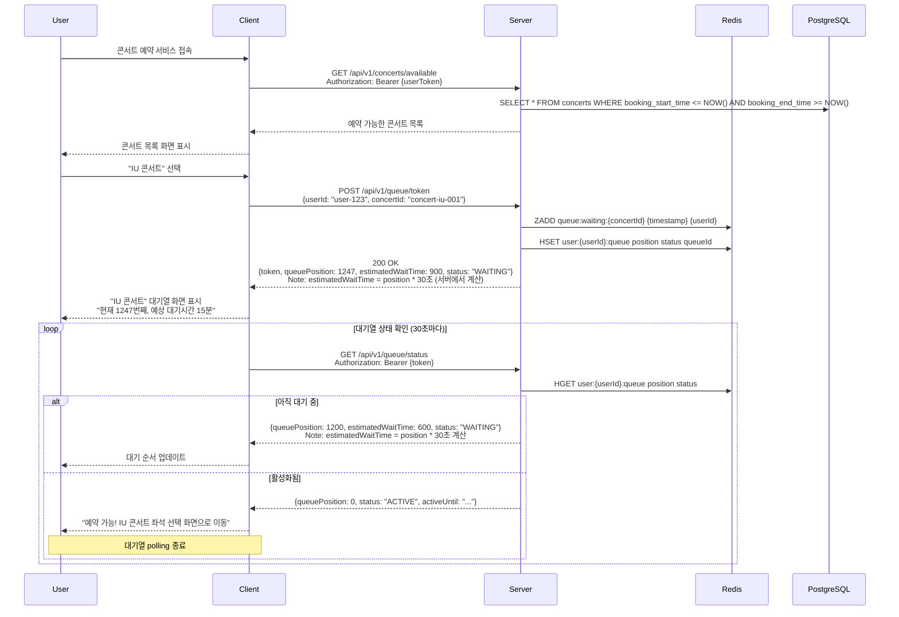
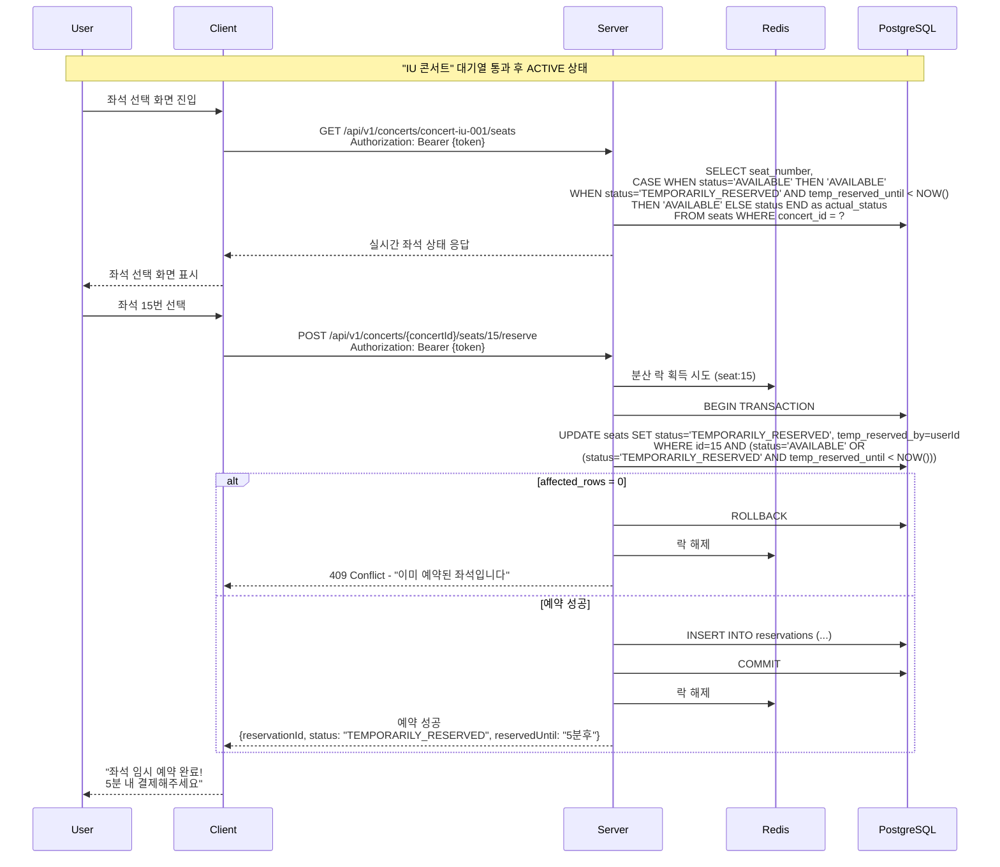
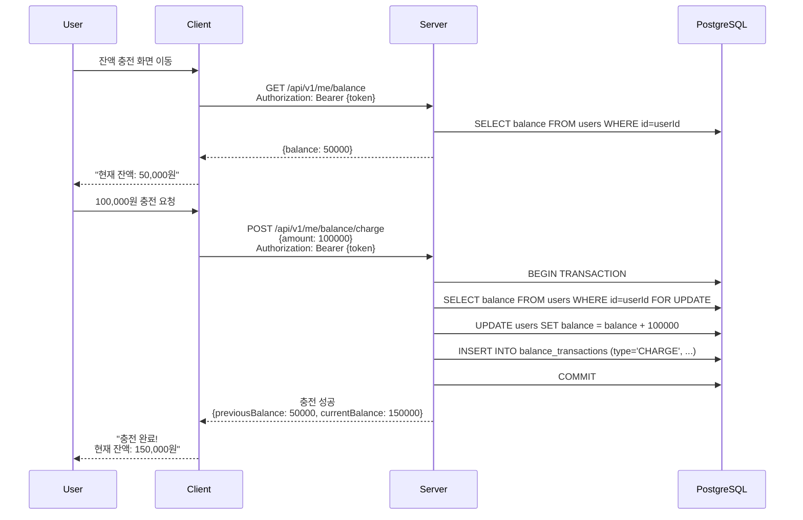
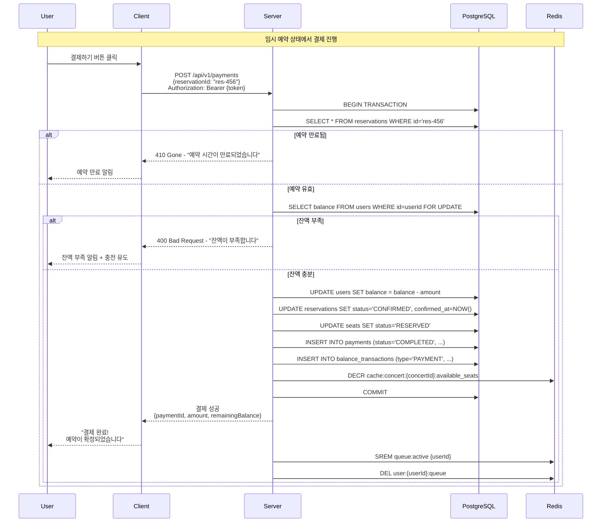
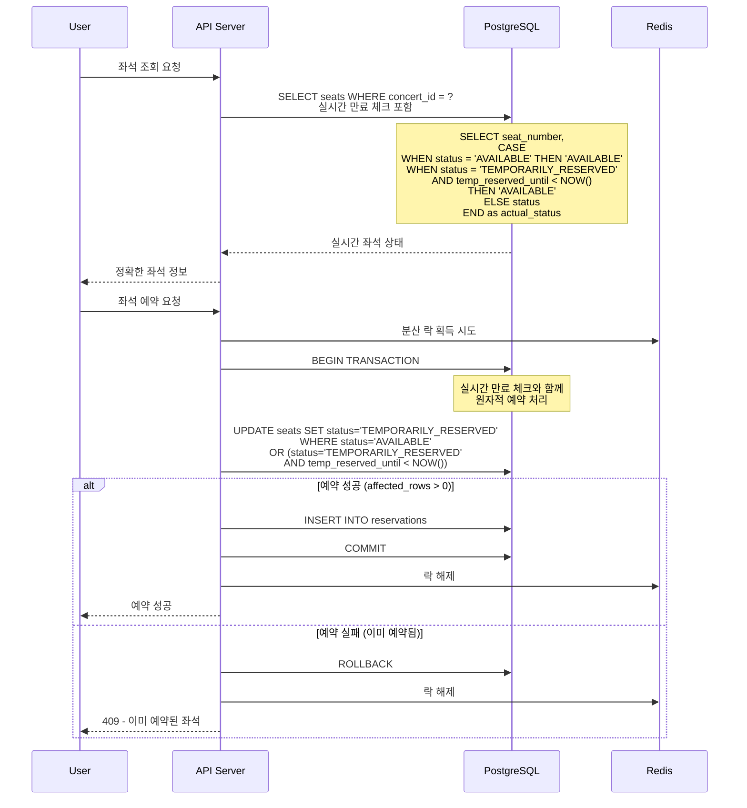
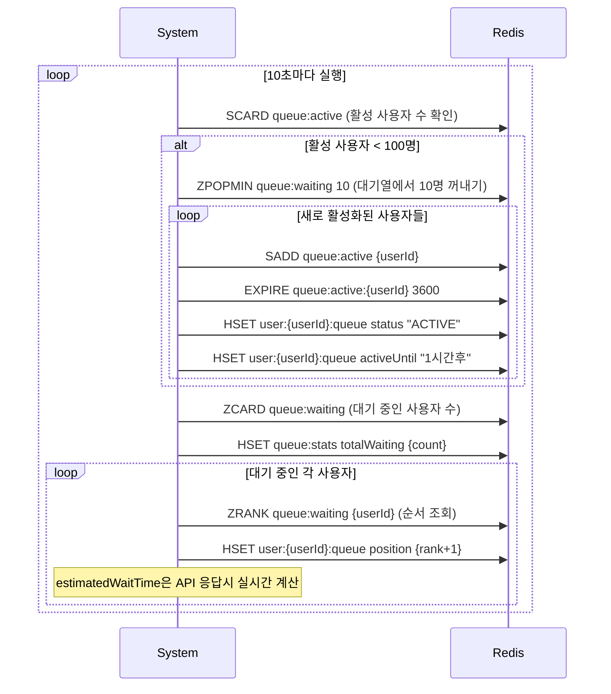
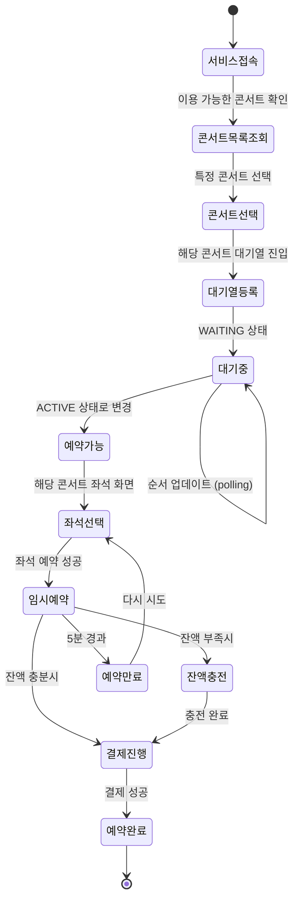

# 서비스 플로우 차트

## 개요

콘서트 예약 서비스의 주요 유즈케이스별 클라이언트-서버 상호작용 플로우를 정의합니다.

---

## 주요 유즈케이스

### 1. 대기열 진입 및 대기 플로우

### 2. 콘서트 예약 플로우

### 3. 잔액 충전 플로우

### 4. 결제 및 완료 플로우

---

## 1. 대기열 진입 및 대기 플로우

---

## 2. 콘서트 예약 플로우

---

## 3. 잔액 충전 플로우

---

## 4. 결제 및 완료 플로우

---

## 예외 상황 플로우

### 4.1 임시 예약 만료 처리

### 4.2 대기열 상태 변경 처리

---

## 클라이언트 상태 관리

### 주요 상태 전환

---
