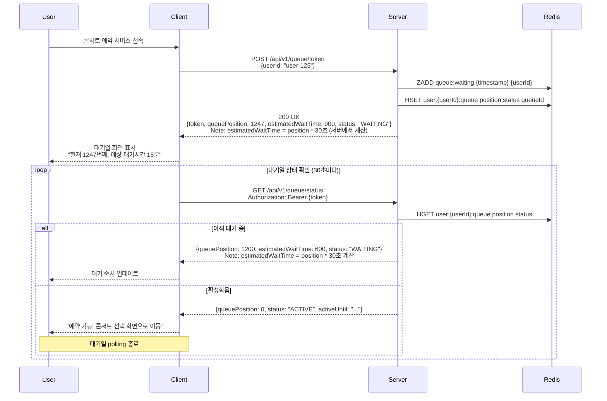
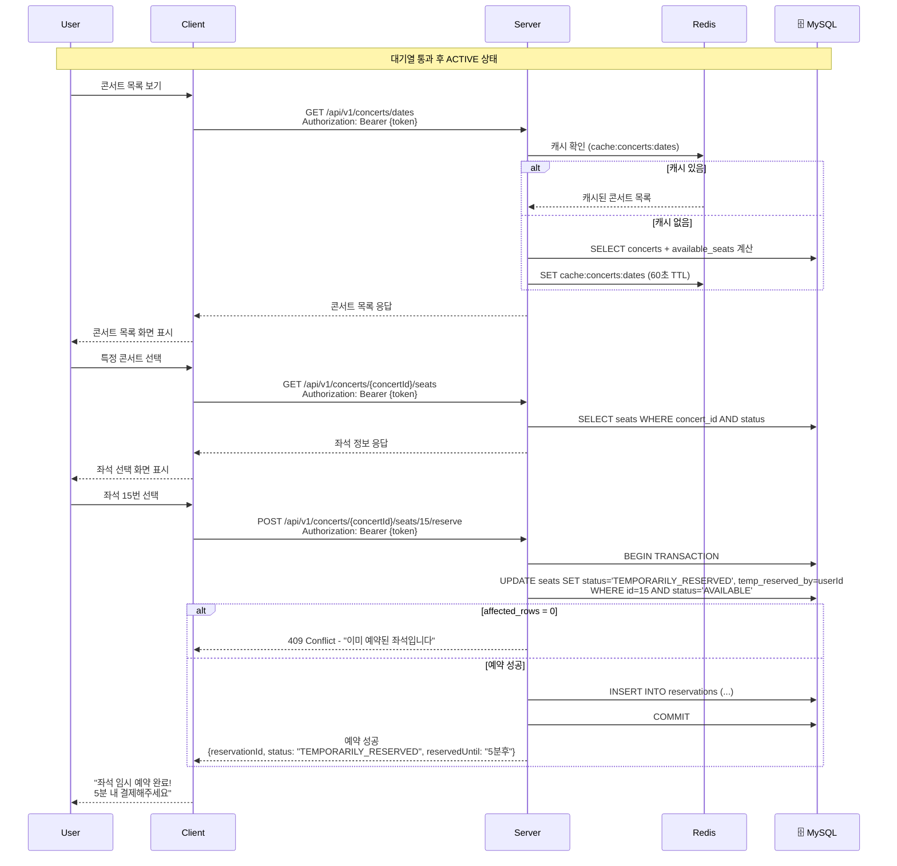
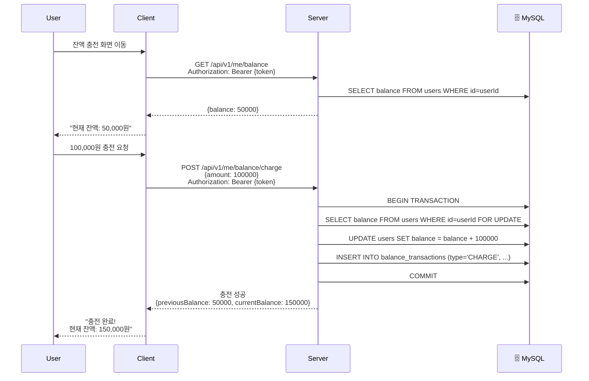
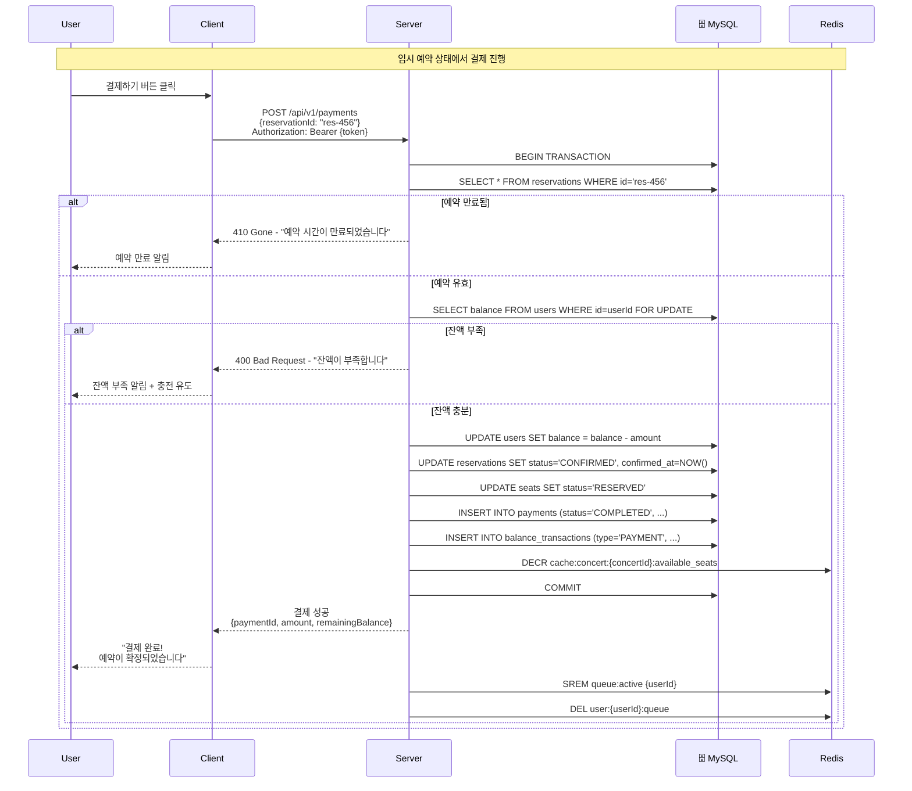
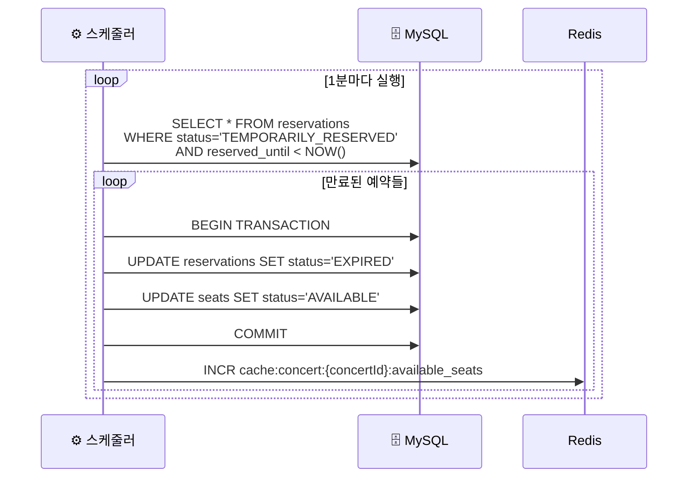
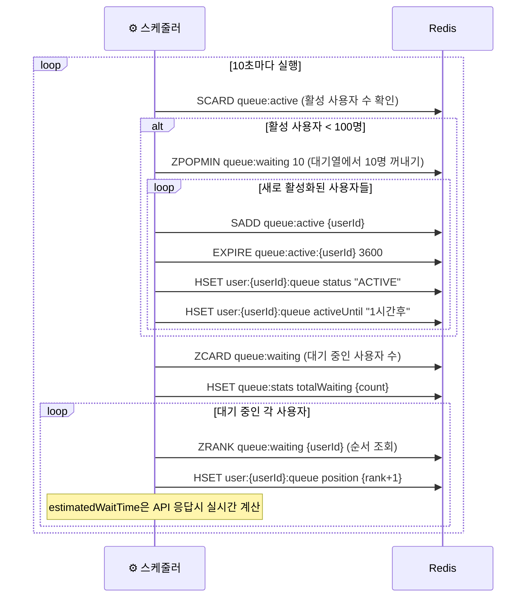
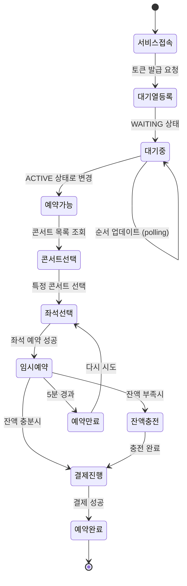

# 서비스 플로우 차트

## 개요

콘서트 예약 서비스의 주요 유즈케이스별 클라이언트-서버 상호작용 플로우를 정의합니다.

---

## 주요 유즈케이스

### 1. 대기열 진입 및 대기 플로우

### 2. 콘서트 예약 플로우

### 3. 잔액 충전 플로우

### 4. 결제 및 완료 플로우

---

## 1. 대기열 진입 및 대기 플로우


```mermaid
sequenceDiagram
    participant User as User
    participant Client as Client
    participant Server as Server
    participant Redis as Redis

    User->>Client: 콘서트 예약 서비스 접속
    Client->>Server: POST /api/v1/queue/token<br/>{userId: "user-123"}

    Server->>Redis: ZADD queue:waiting {timestamp} {userId}
    Server->>Redis: HSET user:{userId}:queue position status queueId
    Server-->>Client: 200 OK<br/>{token, queuePosition: 1247, estimatedWaitTime: 900, status: "WAITING"}<br/>Note: estimatedWaitTime = position * 30초 (서버에서 계산)

    Client-->>User: 대기열 화면 표시<br/>"현재 1247번째, 예상 대기시간 15분"

    loop 대기열 상태 확인 (30초마다)
        Client->>Server: GET /api/v1/queue/status<br/>Authorization: Bearer {token}
        Server->>Redis: HGET user:{userId}:queue position status

        alt 아직 대기 중
            Server-->>Client: {queuePosition: 1200, estimatedWaitTime: 600, status: "WAITING"}<br/>Note: estimatedWaitTime = position * 30초 계산
            Client-->>User: 대기 순서 업데이트
        else 활성화됨
            Server-->>Client: {queuePosition: 0, status: "ACTIVE", activeUntil: "..."}
            Client-->>User: "예약 가능! 콘서트 선택 화면으로 이동"
            Note over Client,User: 대기열 polling 종료
        end
    end
```

---

## 2. 콘서트 예약 플로우


```mermaid
sequenceDiagram
    participant User as User
    participant Client as Client
    participant Server as Server
    participant Redis as Redis
    participant DB as 🗄️ MySQL

    Note over User,DB: 대기열 통과 후 ACTIVE 상태

    User->>Client: 콘서트 목록 보기
    Client->>Server: GET /api/v1/concerts/dates<br/>Authorization: Bearer {token}

    Server->>Redis: 캐시 확인 (cache:concerts:dates)
    alt 캐시 있음
        Redis-->>Server: 캐시된 콘서트 목록
    else 캐시 없음
        Server->>DB: SELECT concerts + available_seats 계산
        Server->>Redis: SET cache:concerts:dates (60초 TTL)
    end

    Server-->>Client: 콘서트 목록 응답
    Client-->>User: 콘서트 목록 화면 표시

    User->>Client: 특정 콘서트 선택
    Client->>Server: GET /api/v1/concerts/{concertId}/seats<br/>Authorization: Bearer {token}
    Server->>DB: SELECT seats WHERE concert_id AND status
    Server-->>Client: 좌석 정보 응답
    Client-->>User: 좌석 선택 화면 표시

    User->>Client: 좌석 15번 선택
    Client->>Server: POST /api/v1/concerts/{concertId}/seats/15/reserve<br/>Authorization: Bearer {token}

    Server->>DB: BEGIN TRANSACTION
    Server->>DB: UPDATE seats SET status='TEMPORARILY_RESERVED', temp_reserved_by=userId<br/>WHERE id=15 AND status='AVAILABLE'
    alt affected_rows = 0
        Server-->>Client: 409 Conflict - "이미 예약된 좌석입니다"
    else 예약 성공
        Server->>DB: INSERT INTO reservations (...)
        Server->>DB: COMMIT
        Server-->>Client: 예약 성공<br/>{reservationId, status: "TEMPORARILY_RESERVED", reservedUntil: "5분후"}
    end
    Client-->>User: "좌석 임시 예약 완료!<br/>5분 내 결제해주세요"
```

---

## 3. 잔액 충전 플로우


```mermaid
sequenceDiagram
    participant User as User
    participant Client as Client
    participant Server as Server
    participant DB as 🗄️ MySQL

    User->>Client: 잔액 충전 화면 이동
    Client->>Server: GET /api/v1/me/balance<br/>Authorization: Bearer {token}
    Server->>DB: SELECT balance FROM users WHERE id=userId
    Server-->>Client: {balance: 50000}
    Client-->>User: "현재 잔액: 50,000원"

    User->>Client: 100,000원 충전 요청
    Client->>Server: POST /api/v1/me/balance/charge<br/>{amount: 100000}<br/>Authorization: Bearer {token}

    Server->>DB: BEGIN TRANSACTION
    Server->>DB: SELECT balance FROM users WHERE id=userId FOR UPDATE
    Server->>DB: UPDATE users SET balance = balance + 100000
    Server->>DB: INSERT INTO balance_transactions (type='CHARGE', ...)
    Server->>DB: COMMIT

    Server-->>Client: 충전 성공<br/>{previousBalance: 50000, currentBalance: 150000}
    Client-->>User: "충전 완료!<br/>현재 잔액: 150,000원"
```

---

## 4. 결제 및 완료 플로우


```mermaid
sequenceDiagram
    participant User as User
    participant Client as Client
    participant Server as Server
    participant DB as 🗄️ MySQL
    participant Redis as Redis

    Note over User,Redis: 임시 예약 상태에서 결제 진행

    User->>Client: 결제하기 버튼 클릭
    Client->>Server: POST /api/v1/payments<br/>{reservationId: "res-456"}<br/>Authorization: Bearer {token}

    Server->>DB: BEGIN TRANSACTION

    # 예약 상태 확인
    Server->>DB: SELECT * FROM reservations WHERE id='res-456'
    alt 예약 만료됨
        Server-->>Client: 410 Gone - "예약 시간이 만료되었습니다"
        Client-->>User: 예약 만료 알림
    else 예약 유효
        # 잔액 확인 및 차감
        Server->>DB: SELECT balance FROM users WHERE id=userId FOR UPDATE
        alt 잔액 부족
            Server-->>Client: 400 Bad Request - "잔액이 부족합니다"
            Client-->>User: 잔액 부족 알림 + 충전 유도
        else 잔액 충분
            # 결제 처리
            Server->>DB: UPDATE users SET balance = balance - amount
            Server->>DB: UPDATE reservations SET status='CONFIRMED', confirmed_at=NOW()
            Server->>DB: UPDATE seats SET status='RESERVED'
            Server->>DB: INSERT INTO payments (status='COMPLETED', ...)
            Server->>DB: INSERT INTO balance_transactions (type='PAYMENT', ...)

            # 캐시 업데이트
            Server->>Redis: DECR cache:concert:{concertId}:available_seats

            Server->>DB: COMMIT

            Server-->>Client: 결제 성공<br/>{paymentId, amount, remainingBalance}
            Client-->>User: "결제 완료!<br/>예약이 확정되었습니다"

            # 대기열에서 제거
            Server->>Redis: SREM queue:active {userId}
            Server->>Redis: DEL user:{userId}:queue
        end
    end
```

---

## 예외 상황 플로우

### 4.1 임시 예약 만료 처리


```mermaid
sequenceDiagram
    participant System as ⚙️ 스케줄러
    participant DB as 🗄️ MySQL
    participant Redis as Redis

    loop 1분마다 실행
        System->>DB: SELECT * FROM reservations<br/>WHERE status='TEMPORARILY_RESERVED'<br/>AND reserved_until < NOW()

        loop 만료된 예약들
            System->>DB: BEGIN TRANSACTION
            System->>DB: UPDATE reservations SET status='EXPIRED'
            System->>DB: UPDATE seats SET status='AVAILABLE'
            System->>DB: COMMIT

            System->>Redis: INCR cache:concert:{concertId}:available_seats
        end
    end
```

### 4.2 대기열 상태 변경 처리


```mermaid
sequenceDiagram
    participant System as ⚙️ 스케줄러
    participant Redis as Redis

    loop 10초마다 실행
        System->>Redis: SCARD queue:active (활성 사용자 수 확인)

        alt 활성 사용자 < 100명
            System->>Redis: ZPOPMIN queue:waiting 10 (대기열에서 10명 꺼내기)

            loop 새로 활성화된 사용자들
                System->>Redis: SADD queue:active {userId}
                System->>Redis: EXPIRE queue:active:{userId} 3600
                System->>Redis: HSET user:{userId}:queue status "ACTIVE"
                System->>Redis: HSET user:{userId}:queue activeUntil "1시간후"
            end
        end

        # 대기 순서 업데이트 (위치만)
        System->>Redis: ZCARD queue:waiting (대기 중인 사용자 수)
        System->>Redis: HSET queue:stats totalWaiting {count}

        loop 대기 중인 각 사용자
            System->>Redis: ZRANK queue:waiting {userId} (순서 조회)
            System->>Redis: HSET user:{userId}:queue position {rank+1}
            Note over System: estimatedWaitTime은 API 응답시 실시간 계산
        end
    end
```

---

## 클라이언트 상태 관리

### 주요 상태 전환


```mermaid
stateDiagram-v2
    [*] --> 서비스접속
    서비스접속 --> 대기열등록: 토큰 발급 요청
    대기열등록 --> 대기중: WAITING 상태
    대기중 --> 대기중: 순서 업데이트 (polling)
    대기중 --> 예약가능: ACTIVE 상태로 변경
    예약가능 --> 콘서트선택: 콘서트 목록 조회
    콘서트선택 --> 좌석선택: 특정 콘서트 선택
    좌석선택 --> 임시예약: 좌석 예약 성공
    임시예약 --> 잔액충전: 잔액 부족시
    임시예약 --> 결제진행: 잔액 충분시
    잔액충전 --> 결제진행: 충전 완료
    결제진행 --> 예약완료: 결제 성공
    예약완료 --> [*]

    임시예약 --> 예약만료: 5분 경과
    예약만료 --> 좌석선택: 다시 시도
```

---

## 🎯 동시성 제어 방법 비교

### **🥇 간단하고 효과적**: SQL 조건부 UPDATE

```sql
-- 한 줄로 동시성 제어 완료
UPDATE seats SET status='TEMPORARILY_RESERVED', temp_reserved_by='user-123'
WHERE id=1 AND status='AVAILABLE';

-- affected_rows = 0 → 이미 예약됨 (409 응답)
-- affected_rows = 1 → 예약 성공 (200 응답)
```

**장점:**

- 코드가 단순함
- DB가 알아서 동시성 처리
- 트랜잭션 필요 없음
- 성능 우수

### **🥈 Redis 분산 락**: 확장성 중요한 경우

```redis
# 좌석 점유 시도 (10초 TTL, NX=존재하지 않을 때만 설정)
SET seat:1:lock user-123 EX 10 NX

# 응답: OK → 점유 성공, (nil) → 이미 점유됨
```

**장점:**

- 마이크로서비스에서 유용
- 확장성 좋음
- 복잡한 비즈니스 로직에 적합
- TTL로 자동 해제

### **🥉 낙관적 락**: 복잡한 경우에만

```sql
-- 3단계 필요 (복잡함)
SELECT version FROM seats WHERE id=1;
UPDATE seats SET version=version+1 WHERE id=1 AND version=?;
-- version mismatch 처리
```

**단점:**

- 코드 복잡성 증가
- 재시도 로직 필요
- 성능 오버헤드

---

## 🎯 결론

**콘서트 예약 시스템**에서는 **간단한 조건부 UPDATE**가 가장 적합합니다!

- 단순하고 효과적
- 높은 성능
- 유지보수 용이
- 충분한 동시성 보장

Redis나 낙관적 락은 **정말 필요한 경우에만** 고려하면 됩니다.

---
